# Linux命令操作部分

## Ubuntu虚拟机使用

### 快照

拍摄快照是为了方便还原虚拟机，因为虚拟机(Virtual Machine)是虚拟出来的出来的一台物理计算机，如果你在实验中操作不当或者其他原因导致虚拟机无法正常使用，如果你之前打过快照(Snapshot)，那么你就可以很方便的恢复到上一次打快照的地方

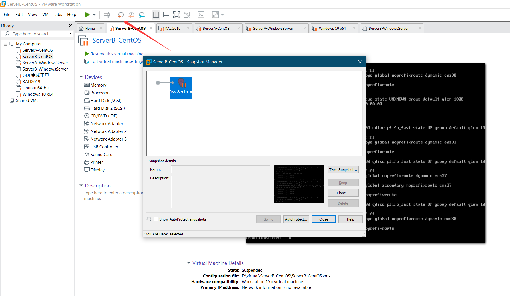

### 挂起虚拟机

挂起虚拟机的作用是为了下次更加方便虚拟机的打开，如果直接关闭虚拟机的话虚拟机就有可能出一些问题，因此不建议直接关闭虚拟机

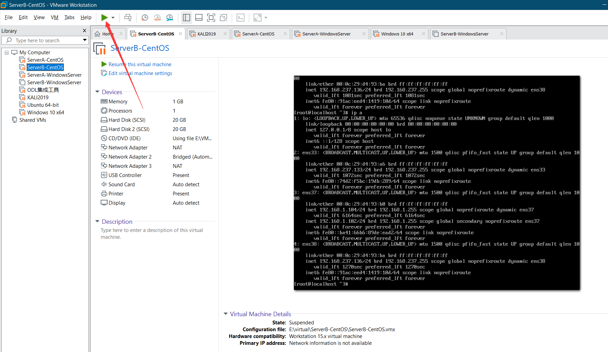


## 百度语法(论文搜索)

这些百度语法在百度搜索引擎中可以更快的搜索出你想要的东西

用途：当你要写一些论文什么的就可以这样搜索查找，可以很大几率避免和别人重复

例如 你想要找一些doc文档 ，那你可以在百度的搜索框中键入 linux嵌入式编程 filetype:doc 就可以搜索出来所有doc的文档而略过其他很多乱七八糟的东西


如果你想要搜索另外其他指定类型的文档而不想记这些复杂的命令可以访问

https://www.baidu.com/gaoji/advanced.html

该网址可以让你使用百度的高级搜索

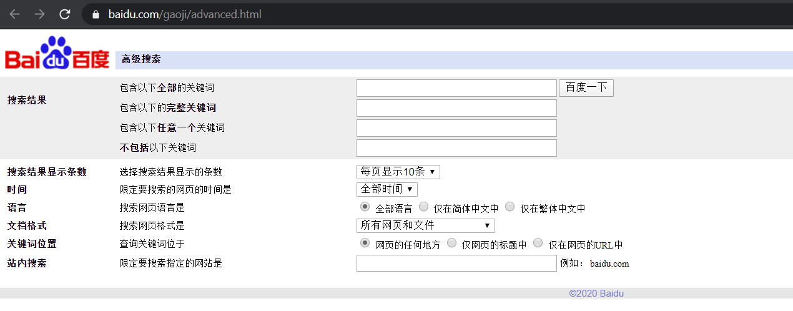

查看更多帮助

https://jingyan.baidu.com/article/d621e8dae7593c2864913f7b.html

## Linux常用命令(快捷键)

### ls命令

ls命令用来显示目标列表，在Linux中是使用率较高的命令。ls命令的输出信息可以进行彩色加亮显示，以分区不同类型的文件

```
选项：
-a：显示所有档案及目录（ls内定将档案名或目录名称为“.”的视为影藏，不会列出）；
-A：显示除影藏文件“.”和“..”以外的所有文件列表；
-C：多列显示输出结果。这是默认选项；
-l：与“-C”选项功能相反，所有输出信息用单列格式输出，不输出为多列；
-F：在每个输出项后追加文件的类型标识符，具体含义：“*”表示具有可执行权限的普通文件，“/”表示目录，“@”表示符号链接，“|”表示命令管道FIFO，“=”表示sockets套接字。当文件为普通文件时，不输出任何标识符；
-b：将文件中的不可输出的字符以反斜线“”加字符编码的方式输出；
-c：与“-lt”选项连用时，按照文件状态时间排序输出目录内容，排序的依据是文件的索引节点中的ctime字段。与“-l”选项连用时，则排序的一句是文件的状态改变时间；
-d：仅显示目录名，而不显示目录下的内容列表。显示符号链接文件本身，而不显示其所指向的目录列表；
-f：此参数的效果和同时指定“aU”参数相同，并关闭“lst”参数的效果；
-i：显示文件索引节点号（inode）。一个索引节点代表一个文件；
--file-type：与“-F”选项的功能相同，但是不显示“*”；
-k：以KB（千字节）为单位显示文件大小；
-l：以长格式显示目录下的内容列表。输出的信息从左到右依次包括文件名，文件类型、权限模式、硬连接数、所有者、组、文件大小和文件的最后修改时间等；
-m：用“,”号区隔每个文件和目录的名称；
-n：以用户识别码和群组识别码替代其名称；
-r：以文件名反序排列并输出目录内容列表；
-s：显示文件和目录的大小，以区块为单位；
-t：用文件和目录的更改时间排序；
-L：如果遇到性质为符号链接的文件或目录，直接列出该链接所指向的原始文件或目录；
-R：递归处理，将指定目录下的所有文件及子目录一并处理；
--full-time：列出完整的日期与时间；
--color[=WHEN]：使用不同的颜色高亮显示不同类型的。
```

示例：

显示当前目录下非影藏文件与目录

```bash
[root@localhost ~]# ls
anaconda-ks.cfg  install.log  install.log.syslog  satools
```

显示当前目录下包括影藏文件在内的所有文件列表

```bash
[root@localhost ~]# ls -a
.   anaconda-ks.cfg  .bash_logout   .bashrc  install.log         .mysql_history  satools  .tcshrc   .vimrc
..  .bash_history    .bash_profile  .cshrc   install.log.syslog  .rnd            .ssh     .viminfo
```

显示文件的inode信息

索引节点（index inode简称为“inode”）是Linux中一个特殊的概念，具有相同的索引节点号的两个文本本质上是同一个文件（除文件名不同外）。

```bash
[root@localhost ~]# ls -i -l anaconda-ks.cfg install.log
2345481 -rw------- 1 root root   859 Jun 11 22:49 anaconda-ks.cfg
2345474 -rw-r--r-- 1 root root 13837 Jun 11 22:49 install.log
```

按修改时间列出文件和文件夹详细信息

```bash
[root@localhost /]# ls -ltr

total 254
drwxr-xr-x   2 root root  4096 Nov  8  2010 misc
drwxr-xr-x   2 root root  4096 May 11  2011 srv
drwxr-xr-x   2 root root  4096 May 11  2011 selinux
drwxr-xr-x   2 root root  4096 May 11  2011 opt
```

### cd命令

cd命令用来切换工作目录至[dirname](http://man.linuxde.net/dirname)。 其中dirName表示法可为绝对路径或相对路径。若目录名称省略，则变换至使用者的home directory(也就是刚[login](http://man.linuxde.net/login)时所在的目录)。另外，`~`也表示为home directory的意思，`.`则是表示目前所在的目录，`..`则表示目前目录位置的上一层目录。

```bash
cd / #根目录
cd    #进入用户主目录；
cd ~  #进入用户主目录；
cd -  #返回进入此目录之前所在的目录；
cd ..  #返回上级目录（若当前目录为“/“，则执行完后还在“/"；".."为上级目录的意思）；
cd ../..  #返回上两级目录；
cd !$  #把上个命令的参数作为cd参数使用。
```

### cp命令

cp命令用来将一个或多个源文件或者目录复制到指定的目的文件或目录。它可以将单个源文件复制成一个指定文件名的具体的文件或一个已经存在的目录下。cp命令还支持同时复制多个文件，当一次复制多个文件时，目标文件参数必须是一个已经存在的目录，否则将出现错误

```
选项：
-a：此参数的效果和同时指定"-dpR"参数相同；
-d：当复制符号连接时，把目标文件或目录也建立为符号连接，并指向与源文件或目录连接的原始文件或目录；
-f：强行复制文件或目录，不论目标文件或目录是否已存在；
-i：覆盖既有文件之前先询问用户；
-l：对源文件建立硬连接，而非复制文件；
-p：保留源文件或目录的属性；
-R/r：递归处理，将指定目录下的所有文件与子目录一并处理；
-s：对源文件建立符号连接，而非复制文件；
-u：使用这项参数后只会在源文件的更改时间较目标文件更新时或是名称相互对应的目标文件并不存在时，才复制文件；
-S：在备份文件时，用指定的后缀“SUFFIX”代替文件的默认后缀；
-b：覆盖已存在的文件目标前将目标文件备份；
-v：详细显示命令执行的操作。
```

示例：

如果把一个文件复制到一个目标文件中，而目标文件已经存在，那么，该目标文件的内容将被破坏。此命令中所有参数既可以是绝对路径名，也可以是相对路径名。通常会用到点`.`或点点`..`的形式。例如，下面的命令将指定文件复制到当前目录下：

```
cp ../mary/homework/assign .
```

所有目标文件指定的目录必须是己经存在的，cp命令不能创建目录。如果没有文件复制的权限，则系统会显示出错信息。

将文件[file](http://man.linuxde.net/file)复制到目录`/usr/men/tmp`下，并改名为file1

```
cp file /usr/men/tmp/file1
```

将目录`/usr/men`下的所有文件及其子目录复制到目录`/usr/zh`中

```
cp -r /usr/men /usr/zh
```

交互式地将目录`/usr/men`中的以m打头的所有.c文件复制到目录`/usr/zh`中

```
cp -i /usr/men m*.c /usr/zh
```

我们在Linux下使用cp命令复制文件时候，有时候会需要覆盖一些同名文件，覆盖文件的时候都会有提示：需要不停的按Y来确定执行覆盖。文件数量不多还好，但是要是几百个估计按Y都要吐血了

```bash
cp aaa/* /bbb
复制目录aaa下所有到/bbb目录下，这时如果/bbb目录下有和aaa同名的文件，需要按Y来确认并且会略过aaa目录下的子目录。

cp -r aaa/* /bbb
这次依然需要按Y来确认操作，但是没有忽略子目录。

cp -r -a aaa/* /bbb
依然需要按Y来确认操作，并且把aaa目录以及子目录和文件属性也传递到了/bbb。

\cp -r -a aaa/* /bbb
成功，没有提示按Y、传递了目录属性、没有略过目录。
```

### mv命令

mv命令用来对文件或目录重新命名，或者将文件从一个目录移到另一个目录中。source表示源文件或目录，target表示目标文件或目录。如果将一个文件移到一个已经存在的目标文件中，则目标文件的内容将被覆盖。

mv命令可以用来将源文件移至一个目标文件中，或将一组文件移至一个目标目录中。源文件被移至目标文件有两种不同的结果：

1. 如果目标文件是到某一目录文件的路径，源文件会被移到此目录下，且文件名不变。
2. 如果目标文件不是目录文件，则源文件名（只能有一个）会变为此目标文件名，并覆盖己存在的同名文件。如果源文件和目标文件在同一个目录下，mv的作用就是改文件名。当目标文件是目录文件时，源文件或目录参数可以有多个，则所有的源文件都会被移至目标文件中。所有移到该目录下的文件都将保留以前的文件名。

注意事项：mv与[cp](http://man.linuxde.net/cp)的结果不同，mv好像文件“搬家”，文件个数并未增加。而cp对文件进行复制，文件个数增加了。

```
选项：
--backup=<备份模式>：若需覆盖文件，则覆盖前先行备份；
-b：当文件存在时，覆盖前，为其创建一个备份；
-f：若目标文件或目录与现有的文件或目录重复，则直接覆盖现有的文件或目录；
-i：交互式操作，覆盖前先行询问用户，如果源文件与目标文件或目标目录中的文件同名，则询问用户是否覆盖目标文件。用户输入”y”，表示将覆盖目标文件；输入”n”，表示取消对源文件的移动。这样可以避免误将文件覆盖。
--strip-trailing-slashes：删除源文件中的斜杠“/”；
-S<后缀>：为备份文件指定后缀，而不使用默认的后缀；
--target-directory=<目录>：指定源文件要移动到目标目录；
-u：当源文件比目标文件新或者目标文件不存在时，才执行移动操作。
```

示例：

将文件ex3改名为new1

```
mv ex3 new1
```

将目录`/usr/men`中的所有文件移到当前目录（用`.`表示）中：

```
mv /usr/men/* .
```

### mkdir命令

mkdir命令用来创建目录。该命令创建由[dirname](http://man.linuxde.net/dirname)命名的目录。如果在目录名的前面没有加任何路径名，则在当前目录下创建由dirname指定的目录；如果给出了一个已经存在的路径，将会在该目录下创建一个指定的目录。在创建目录时，应保证新建的目录与它所在目录下的文件没有重名。 

注意：在创建文件时，不要把所有的文件都存放在主目录中，可以创建子目录，通过它们来更有效地组织文件。最好采用前后一致的命名方式来区分文件和目录。例如，目录名可以以大写字母开头，这样，在目录列表中目录名就出现在前面。

在一个子目录中应包含类型相似或用途相近的文件。例如，应建立一个子目录，它包含所有的数据库文件，另有一个子目录应包含电子表格文件，还有一个子目录应包含文字处理文档，等等。目录也是文件，它们和普通文件一样遵循相同的命名规则，并且利用全路径可以唯一地指定一个目录。

```
选项：
-Z：设置安全上下文，当使用SELinux时有效；
-m<目标属性>或--mode<目标属性>建立目录的同时设置目录的权限；
-p或--parents 若所要建立目录的上层目录目前尚未建立，则会一并建立上层目录；
--version 显示版本信息。
```

示例：

在目录`/sang/test`下建立子目录test1，并且只有文件主有读、写和执行权限，其他人无权访问

```
mkdir -m 700 /sang/test/test1
```

在当前目录中建立bin和bin下的os_1目录，权限设置为文件主可读、写、执行，同组用户可读和执行，其他用户无权访问

```
mkdir -p -m 750 bin/os_1
```

### touch命令

touch命令有两个功能：一是用于把已存在文件的时间标签更新为系统当前的时间（默认方式），它们的数据将原封不动地保留下来；二是用来创建新的空文件

```
选项：
-a：或--time=atime或--time=access或--time=use  只更改存取时间；
-c：或--no-create  不建立任何文件；
-d：<时间日期> 使用指定的日期时间，而非现在的时间；
-f：此参数将忽略不予处理，仅负责解决BSD版本touch指令的兼容性问题；
-m：或--time=mtime或--time=modify  只更该变动时间；
-r：<参考文件或目录>  把指定文件或目录的日期时间，统统设成和参考文件或目录的日期时间相同；
-t：<日期时间>  使用指定的日期时间，而非现在的时间；
--help：在线帮助；
--version：显示版本信息。
```

示例：

```
touch ex2
```

在当前目录下建立一个空文件ex2，然后，利用`ls -l`命令可以发现文件ex2的大小为0，表示它是空文件。

### rm命令

rm命令可以删除一个目录中的一个或多个文件或目录，也可以将某个目录及其下属的所有文件及其子目录均删除掉。对于链接文件，只是删除整个链接文件，而原有文件保持不变。

注意：使用rm命令要格外小心。因为一旦删除了一个文件，就无法再恢复它。所以，在删除文件之前，最好再看一下文件的内容，确定是否真要删除。rm命令可以用-i选项，这个选项在使用文件扩展名字符删除多个文件时特别有用。使用这个选项，系统会要求你逐一确定是否要删除。这时，必须输入y并按Enter键，才能删除文件。如果仅按Enter键或其他字符，文件不会被删除。

```
选项：
-d：直接把欲删除的目录的硬连接数据删除成0，删除该目录；
-f：强制删除文件或目录；
-i：删除已有文件或目录之前先询问用户；
-r或-R：递归处理，将指定目录下的所有文件与子目录一并处理；
--preserve-root：不对根目录进行递归操作；
-v：显示指令的详细执行过程。
```

示例：

交互式删除当前目录下的文件[test](http://man.linuxde.net/test)和example

```
rm -i test example
Remove test ?n（不删除文件test)
Remove example ?y（删除文件example)
```

删除当前目录下除隐含文件外的所有文件和子目录

```
# rm -r *
```

应注意，这样做是非常危险的!

### pwd命令

pwd命令以绝对路径的方式显示用户当前工作目录。命令将当前目录的全路径名称（从根目录）写入标准输出。全部目录使用`/`分隔。第一个`/`表示根目录，最后一个目录是当前目录。执行pwd命令可立刻得知您目前所在的工作目录的绝对路径名称。

示例：

```bash
[root@localhost ~]# pwd
/root
```

### gcc命令

```
选项：
-o：指定生成的输出文件；
-E：仅执行编译预处理；
-S：将C代码转换为汇编代码；
-wall：显示警告信息；
-c：仅执行编译操作，不进行连接操作。
```

示例：

**常用编译命令选项**

假设源程序文件名为[test](http://man.linuxde.net/test).c

**无选项编译链接**

```
gcc test.c
```

将test.c预处理、汇编、编译并链接形成可执行文件。这里未指定输出文件，默认输出为a.out。

**选项 -o**

```
gcc test.c -o test
```

将test.c预处理、汇编、编译并链接形成可执行文件test。-o选项用来指定输出文件的文件名。

**选项 -E**

```
gcc -E test.c -o test.i
```

将test.c预处理输出test.i文件。

**选项 -S**

```
gcc -S test.i
```

将预处理输出文件test.i汇编成test.s文件。

**选项 -c**

```
gcc -c test.s
```

将汇编输出文件test.s编译输出test.o文件。

**无选项链接**

```
gcc test.o -o test
```

将编译输出文件test.o链接成最终可执行文件test。

**选项 -O**

```
gcc -O1 test.c -o test
```

使用编译优化级别1编译程序。级别为1~3，级别越大优化效果越好，但编译时间越长。

**多源文件的编译方法**

如果有多个源文件，基本上有两种编译方法：

假设有两个源文件为test.c和testfun.c

**多个文件一起编译**

```
gcc testfun.c test.c -o test
```

将testfun.c和test.c分别编译后链接成test可执行文件。

**分别编译各个源文件，之后对编译后输出的目标文件链接。**

```
gcc -c testfun.c    #将testfun.c编译成testfun.o
gcc -c test.c       #将test.c编译成test.o
gcc -o testfun.o test.o -o test    #将testfun.o和test.o链接成test
```

以上两种方法相比较，第一中方法编译时需要所有文件重新编译，而第二种方法可以只重新编译修改的文件，未修改的文件不用重新编译。

### gdb命令

gdb命令包含在GNU的[gcc](http://man.linuxde.net/gcc)开发套件中，是功能强大的程序调试器。

| 命令                                                       | 解释                                                         | 示例                                                         |
| :--------------------------------------------------------- | :----------------------------------------------------------- | :----------------------------------------------------------- |
| [file](http://man.linuxde.net/file) <文件名>               | 加载被调试的可执行程序文件。 因为一般都在被调试程序所在目录下执行GDB，因而文本名不需要带路径。 | (gdb) file gdb-sample                                        |
| r                                                          | Run的简写，运行被调试的程序。 如果此前没有下过断点，则执行完整个程序；如果有断点，则程序暂停在第一个可用断点处。 | (gdb) r                                                      |
| c                                                          | Continue的简写，继续执行被调试程序，直至下一个断点或程序结束。 | (gdb) c                                                      |
| b <行号> b <函数名称> b *<函数名称> b *<代码地址> d [编号] | b: Breakpoint的简写，设置断点。两可以使用“行号”“函数名称”“执行地址”等方式指定断点位置。 其中在函数名称前面加“*”符号表示将断点设置在“由编译器生成的prolog代码处”。如果不了解汇编，可以不予理会此用法。 d: Delete breakpoint的简写，删除指定编号的某个断点，或删除所有断点。断点编号从1开始递增。 | (gdb) b 8 (gdb) b main (gdb) b *main (gdb) b *0x804835c (gdb) d |
| s, n                                                       | s: 执行一行源程序代码，如果此行代码中有函数调用，则进入该函数； n: 执行一行源程序代码，此行代码中的函数调用也一并执行。 s 相当于其它调试器中的“Step Into (单步跟踪进入)”； n 相当于其它调试器中的“Step Over (单步跟踪)”。 这两个命令必须在有源代码调试信息的情况下才可以使用（GCC编译时使用“-g”参数）。 | (gdb) s (gdb) n                                              |
| si, ni                                                     | si命令类似于s命令，ni命令类似于n命令。所不同的是，这两个命令（si/ni）所针对的是汇编指令，而s/n针对的是源代码。 | (gdb) si (gdb) ni                                            |
| p <变量名称>                                               | Print的简写，显示指定变量（临时变量或全局变量）的值。        | (gdb) p i (gdb) p nGlobalVar                                 |
| display ... undisplay <编号>                               | display，设置程序中断后欲显示的数据及其格式。 例如，如果希望每次程序中断后可以看到即将被执行的下一条汇编指令，可以使用命令 “display /i $pc” 其中 $pc 代表当前汇编指令，/i 表示以十六进行显示。当需要关心汇编代码时，此命令相当有用。 undispaly，取消先前的display设置，编号从1开始递增。 | (gdb) display /i $pc (gdb) undisplay 1                       |
| i                                                          | [info](http://man.linuxde.net/info)的简写，用于显示各类信息，详情请查阅“[help](http://man.linuxde.net/help) i”。 | (gdb) i r                                                    |
| q                                                          | Quit的简写，退出GDB调试环境。                                | (gdb) q                                                      |
| help [命令名称]                                            | GDB帮助命令，提供对GDB名种命令的解释说明。 如果指定了“命令名称”参数，则显示该命令的详细说明；如果没有指定参数，则分类显示所有GDB命令，供用户进一步浏览和查询。 | (gdb) help                                                   |

```
选项：
-cd：设置工作目录；
-q：安静模式，不打印介绍信息和版本信息；
-d：添加文件查找路径；
-x：从指定文件中执行GDB指令；
-s：设置读取的符号表文件。
```

示例：

以下是linux下dgb调试的一个实例，先给出一个示例用的小程序，C语言代码：

```c
#include <stdio.h>
int nGlobalVar = 0;

int tempFunction(int a, int b)
{
    printf("tempFunction is called, a = %d, b = %d /n", a, b);
    return (a + b);
}

int main()
{
    int n;
        n = 1;
        n++;
        n--;

        nGlobalVar += 100;
        nGlobalVar -= 12;

    printf("n = %d, nGlobalVar = %d /n", n, nGlobalVar);

        n = tempFunction(1, 2);
    printf("n = %d", n);

    return 0;
}
```

请将此代码复制出来并保存到文件 gdb-sample.c 中，然后切换到此文件所在目录，用GCC编译之：

```
gcc gdb-sample.c -o gdb-sample -g
```

在上面的命令行中，使用 -o 参数指定了编译生成的可执行文件名为 gdb-sample，使用参数 -g 表示将源代码信息编译到可执行文件中。如果不使用参数 -g，会给后面的GDB调试造成不便。当然，如果我们没有程序的源代码，自然也无从使用 -g 参数，调试/跟踪时也只能是汇编代码级别的调试/跟踪。

下面“gdb”命令启动GDB，将首先显示GDB说明，不管它：

```
GNU gdb Red Hat Linux (5.3post-0.20021129.18rh)
Copyright 2003 free Software Foundation, Inc.
GDB is free software, covered by the GNU General Public License, and you are
welcome to change it and/or distribute copies of it under certain conditions.
type "show copying" to see the conditions.
There is absolutely no warranty for GDB. Type "show warranty" for details.
This GDB was configured as "i386-redhat-linux-gnu".
(gdb)
```

上面最后一行“(gdb)”为GDB内部命令引导符，等待用户输入GDB命令。

下面使用“file”命令载入被调试程序 gdb-sample（这里的 gdb-sample 即前面 GCC 编译输出的可执行文件）：

```
(gdb) file gdb-sample
Reading symbols from gdb-sample...done.
```

上面最后一行提示已经加载成功。

下面使用“r”命令执行（Run）被调试文件，因为尚未设置任何断点，将直接执行到程序结束：

```
(gdb) r
Starting program: /home/liigo/temp/test_jmp/test_jmp/gdb-sample
n = 1, nGlobalVar = 88
tempFunction is called, a = 1, b = 2
n = 3
Program exited normally.
```

下面使用“b”命令在 main 函数开头设置一个断点（Breakpoint）：

```
(gdb) b main
Breakpoint 1 at 0x804835c: file gdb-sample.c, line 19.
```

上面最后一行提示已经成功设置断点，并给出了该断点信息：在源文件 gdb-sample.c 第19行处设置断点；这是本程序的第一个断点（序号为1）；断点处的代码地址为 0x804835c（此值可能仅在本次调试过程中有效）。回过头去看源代码，第19行中的代码为“n = 1”，恰好是 main 函数中的第一个可执行语句（前面的“int n;”为变量定义语句，并非可执行语句）。

再次使用“r”命令执行（Run）被调试程序：

```
(gdb) r
Starting program: /home/liigo/temp/gdb-sample

Breakpoint 1, main () at gdb-sample.c:19
19 n = 1;
```

程序中断在gdb-sample.c第19行处，即main函数是第一个可执行语句处。

上面最后一行信息为：下一条将要执行的源代码为“n = 1;”，它是源代码文件gdb-sample.c中的第19行。

下面使用“s”命令（Step）执行下一行代码（即第19行“n = 1;”）：

```
(gdb) s
20 n++;
```

上面的信息表示已经执行完“n = 1;”，并显示下一条要执行的代码为第20行的“n++;”。

既然已经执行了“n = 1;”，即给变量 n 赋值为 1，那我们用“p”命令（Print）看一下变量 n 的值是不是 1 ：

```
(gdb) p n
$1 = 1
```

果然是 1。（$1大致是表示这是第一次使用“p”命令——再次执行“p n”将显示“$2 = 1”——此信息应该没有什么用处。）

下面我们分别在第26行、tempFunction 函数开头各设置一个断点（分别使用命令“b 26”“b tempFunction”）：

```
(gdb) b 26
Breakpoint 2 at 0x804837b: file gdb-sample.c, line 26.
(gdb) b tempFunction
Breakpoint 3 at 0x804832e: file gdb-sample.c, line 12.
```

使用“c”命令继续（Continue）执行被调试程序，程序将中断在第二 个断点（26行），此时全局变量 nGlobalVar 的值应该是 88；再一次执行“c”命令，程序将中断于第三个断点（12行，tempFunction 函数开头处），此时tempFunction 函数的两个参数 a、b 的值应分别是 1 和 2：

```
(gdb) c
Continuing.

Breakpoint 2, main () at gdb-sample.c:26
26 printf("n = %d, nGlobalVar = %d /n", n, nGlobalVar);
(gdb) p nGlobalVar
$2 = 88
(gdb) c
Continuing.
n = 1, nGlobalVar = 88

Breakpoint 3, tempFunction (a=1, b=2) at gdb-sample.c:12
12 printf("tempFunction is called, a = %d, b = %d /n", a, b);
(gdb) p a
$3 = 1
(gdb) p b
$4 = 2
```

上面反馈的信息一切都在我们预料之中~~

再一次执行“c”命令（Continue），因为后面再也没有其它断点，程序将一直执行到结束：

```
(gdb) c
Continuing.
tempFunction is called, a = 1, b = 2
n = 3
Program exited normally.
```

有时候需要看到编译器生成的汇编代码，以进行汇编级的调试或跟踪，又该如何操作呢？

这就要用到display命令“display /i $pc”了（此命令前面已有详细解释）：

```
(gdb) display /i $pc
(gdb)
```

此后程序再中断时，就可以显示出汇编代码了：

```
(gdb) r
Starting program: /home/liigo/temp/test_jmp/test_jmp/gdb-sample

Breakpoint 1, main () at gdb-sample.c:19
19 n = 1;
1: x/i $pc 0x804835c <main+16>: movl $0x1,0xfffffffc(%ebp)
```

看到了汇编代码，“n = 1;”对应的汇编代码是“movl $0x1,0xfffffffc(%ebp)”。

并且以后程序每次中断都将显示下一条汇编指定（“si”命令用于执行一条汇编代码——区别于“s”执行一行C代码）：

```
(gdb) si
20 n++;
1: x/i $pc 0x8048363 <main+23>: lea 0xfffffffc(%ebp),%eax
(gdb) si
0x08048366 20 n++;
1: x/i $pc 0x8048366 <main+26>: incl (%eax)
(gdb) si
21 n--;
1: x/i $pc 0x8048368 <main+28>: lea 0xfffffffc(%ebp),%eax
(gdb) si
0x0804836b 21 n--;
1: x/i $pc 0x804836b <main+31>: decl (%eax)
(gdb) si
23 nGlobalVar += 100;
1: x/i $pc 0x804836d <main+33>: addl $0x64,0x80494fc
```

接下来我们试一下命令“b *<函数名称>”。

为了更简明，有必要先删除目前所有断点（使用“d”命令——Delete breakpoint）：

```
(gdb) d
Delete all breakpoints? (y or n) y
(gdb)
```

当被询问是否删除所有断点时，输入“y”并按回车键即可。

下面使用命令“b *main”在 main 函数的 prolog 代码处设置断点（prolog、epilog，分别表示编译器在每个函数的开头和结尾自行插入的代码）：

```
(gdb) b *main
Breakpoint 4 at 0x804834c: file gdb-sample.c, line 17.
(gdb) r
The program being debugged has been started already.
Start it from the beginning? (y or n) y
Starting program: /home/liigo/temp/test_jmp/test_jmp/gdb-sample

Breakpoint 4, main () at gdb-sample.c:17
17 {
1: x/i $pc 0x804834c <main>: push %ebp
(gdb) si
0x0804834d 17 {
1: x/i $pc 0x804834d <main+1>: mov %esp,%ebp
(gdb) si
0x0804834f in main () at gdb-sample.c:17
17 {
1: x/i $pc 0x804834f <main+3>: sub $0x8,%esp
(gdb) si
0x08048352 17 {
1: x/i $pc 0x8048352 <main+6>: and $0xfffffff0,%esp
(gdb) si
0x08048355 17 {
1: x/i $pc 0x8048355 <main+9>: mov $0x0,%eax
(gdb) si
0x0804835a 17 {
1: x/i $pc 0x804835a <main+14>: sub %eax,%esp
(gdb) si
19 n = 1;
1: x/i $pc 0x804835c <main+16>: movl $0x1,0xfffffffc(%ebp)
```

此时可以使用“i r”命令显示寄存器中的当前值———“i r”即“Infomation Register”：

```
(gdb) i r
eax 0xbffff6a4 -1073744220
ecx 0x42015554 1107383636
edx 0x40016bc8 1073834952
ebx 0x42130a14 1108544020
esp 0xbffff6a0 0xbffff6a0
ebp 0xbffff6a8 0xbffff6a8
esi 0x40015360 1073828704
edi 0x80483f0 134513648
eip 0x8048366 0x8048366
eflags 0x386 902
cs 0x23 35
ss 0x2b 43
ds 0x2b 43
es 0x2b 43
fs 0x0 0
gs 0x33 51
```

当然也可以显示任意一个指定的寄存器值：

```
(gdb) i r eax
eax 0xbffff6a4 -1073744220
```

最后一个要介绍的命令是“q”，退出（Quit）GDB调试环境：

```
(gdb) q
The program is running. exit anyway? (y or n)
```

### cat命令

cat命令连接文件并打印到标准输出设备上，cat经常用来显示文件的内容，类似于下的[type](http://man.linuxde.net/type)命令。

注意：当文件较大时，文本在屏幕上迅速闪过（滚屏），用户往往看不清所显示的内容。因此，一般用[more](http://man.linuxde.net/more)等命令分屏显示。为了控制滚屏，可以按Ctrl+S键，停止滚屏；按Ctrl+Q键可以恢复滚屏。按Ctrl+C（中断）键可以终止该命令的执行，并且返回Shell提示符状态。

```
选项：
-n或-number：有1开始对所有输出的行数编号；
-b或--number-nonblank：和-n相似，只不过对于空白行不编号；
-s或--squeeze-blank：当遇到有连续两行以上的空白行，就代换为一行的空白行；
-A：显示不可打印字符，行尾显示“$”；
-e：等价于"-vE"选项；
-t：等价于"-vT"选项；
```

示例：

设ml和m2是当前目录下的两个文件

```
cat m1 （在屏幕上显示文件ml的内容）
cat m1 m2 （同时显示文件ml和m2的内容）
cat m1 m2 > file （将文件ml和m2合并后放入文件file中
```

### mknod命令

mknod命令用于创建Linux中的字符设备文件和块设备文件

参数：

- 文件名：要创建的设备文件名；
- 类型：指定要创建的设备文件的类型；
- 主设备号：指定设备文件的主设备号；
- 次设备号：指定设备文件的次设备号。

示例：

```bash
ls -la /dev/ttyUSB*
crw-rw—- 1 root dialout 188, 0 2020-02-13 18:32 /dev/ttyUSB0
mknod /dev/ttyUSB32 c 188 32
```

拓展：

Linux的设备管理是和文件系统紧密结合的，各种设备都以文件的形式存放在/dev目录 下，称为设备文件。应用程序可以打开、关闭和读写这些设备文件，完成对设备的操作，就像操作普通的数据文件一样。

为了管理这些设备，系统为设备编了号，每 个设备号又分为主设备号和次设备号。主设备号用来区分不同种类的设备，而次设备号用来区分同一类型的多个设备。对于常用设备，Linux有约定俗成的编 号，如硬盘的主设备号是3。

Linux为所有的设备文件都提供了统一的操作函数接口，方法是使用数据结构struct file_operations。这个数据结构中包括许多操作函数的指针，如open()、close()、[read](http://man.linuxde.net/read)()和[write](http://man.linuxde.net/write)()等，但由于外设 的种类较多，操作方式各不相同。Struct file_operations结构体中的成员为一系列的接口函数，如用于读/写的read/write函数和用于控制的ioctl等。

打开一个文件就是调用这个文件file_operations中的open操作。不同类型的文件有不同的file_operations成员函数，如普通的磁盘数据文件， 接口函数完成磁盘数据块读写操作；而对于各种设备文件，则最终调用各自驱动程序中的I/O函数进行具体设备的操作。这样，应用程序根本不必考虑操作的是设 备还是普通文件，可一律当作文件处理，具有非常清晰统一的I/O接口。所以file_operations是文件层次的I/O接口。

### chmod命令

chmod命令用来变更文件或目录的权限。在UNIX系统家族里，文件或目录权限的控制分别以读取、写入、执行3种一般权限来区分，另有3种特殊权限可供运用。用户可以使用chmod指令去变更文件与目录的权限，设置方式采用文字或数字代号皆可。符号连接的权限无法变更，如果用户对符号连接修改权限，其改变会作用在被连接的原始文件。

权限范围的表示法如下：

`u` User，即文件或目录的拥有者；
`g` Group，即文件或目录的所属群组；
`o` Other，除了文件或目录拥有者或所属群组之外，其他用户皆属于这个范围；
`a` All，即全部的用户，包含拥有者，所属群组以及其他用户；
`r` 读取权限，数字代号为“4”;
`w` 写入权限，数字代号为“2”；
`x` 执行或切换权限，数字代号为“1”；
`-` 不具任何权限，数字代号为“0”；
`s` 特殊功能说明：变更文件或目录的权限。

参数：

权限模式：指定文件的权限模式；
文件：要改变权限的文件。

拓展：

Linux用 户分为：拥有者、组群(Group)、其他（other），Linux系统中，预设的情況下，系统中所有的帐号与一般身份使用者，以及root的相关信 息， 都是记录在`/etc/passwd`文件中。每个人的密码则是记录在`/etc/shadow`文件下。 此外，所有的组群名称记录在`/etc/group`內！

### stat命令

stat命令用于显示文件的状态信息。stat命令的输出信息比[ls](http://man.linuxde.net/ls)命令的输出信息要更详细

示例：

```bash
[root@localhost ~]# ls -l myfile
-rw-r--r-- 1 root root 0 2020-10-09 myfile

[root@localhost ~]# stat myfile
file: “myfile”
Size: 0               Blocks: 8          IO Block: 4096   一般空文件
Device: fd00h/64768d    Inode: 194805815   Links: 1
Access: (0644/-rw-r--r--)  Uid: (    0/    root)   Gid: (    0/    root)
Access: 2020-12-12 12:22:35.000000000 +0800
Modify: 2020-10-09 20:44:21.000000000 +0800
Change: 2020-10-09 20:44:21.000000000 +0800

[root@localhost ~]# stat -f myfile
File: "myfile"
id: 0        Namelen: 255     type: ext2/ext3
Block size: 4096       Fundamental block size: 4096
Blocks: Total: 241555461  free: 232910771  Available: 220442547
Inodes: Total: 249364480  Free: 249139691

[root@localhost ~]# stat -t myfile
myfile 0 8 81a4 0 0 fd00 194805815 1 0 0 1292127755 1286628261 1286628261 4096
```

### find命令

find命令用来在指定目录下查找文件。任何位于参数之前的字符串都将被视为欲查找的目录名。如果使用该命令时，不设置任何参数，则find命令将在当前目录下查找子目录与文件。并且将查找到的子目录和文件全部进行显示。

```
选项：
-amin<分钟>：查找在指定时间曾被存取过的文件或目录，单位以分钟计算；
-anewer<参考文件或目录>：查找其存取时间较指定文件或目录的存取时间更接近现在的文件或目录；
-atime<24小时数>：查找在指定时间曾被存取过的文件或目录，单位以24小时计算；
-cmin<分钟>：查找在指定时间之时被更改过的文件或目录；
-cnewer<参考文件或目录>查找其更改时间较指定文件或目录的更改时间更接近现在的文件或目录；
-ctime<24小时数>：查找在指定时间之时被更改的文件或目录，单位以24小时计算；
-daystart：从本日开始计算时间；
-depth：从指定目录下最深层的子目录开始查找；
-empty：寻找文件大小为0 Byte的文件，或目录下没有任何子目录或文件的空目录；
-exec<执行指令>：假设find指令的回传值为True，就执行该指令；
-false：将find指令的回传值皆设为False；
-fls<列表文件>：此参数的效果和指定“-ls”参数类似，但会把结果保存为指定的列表文件；
-follow：排除符号连接；
-fprint<列表文件>：此参数的效果和指定“-print”参数类似，但会把结果保存成指定的列表文件；
-fprint0<列表文件>：此参数的效果和指定“-print0”参数类似，但会把结果保存成指定的列表文件；
-fprintf<列表文件><输出格式>：此参数的效果和指定“-printf”参数类似，但会把结果保存成指定的列表文件；
-fstype<文件系统类型>：只寻找该文件系统类型下的文件或目录；
-gid<群组识别码>：查找符合指定之群组识别码的文件或目录；
-group<群组名称>：查找符合指定之群组名称的文件或目录；
-help或——help：在线帮助；
-ilname<范本样式>：此参数的效果和指定“-lname”参数类似，但忽略字符大小写的差别；
-iname<范本样式>：此参数的效果和指定“-name”参数类似，但忽略字符大小写的差别；
-inum<inode编号>：查找符合指定的inode编号的文件或目录；
-ipath<范本样式>：此参数的效果和指定“-path”参数类似，但忽略字符大小写的差别；
-iregex<范本样式>：此参数的效果和指定“-regexe”参数类似，但忽略字符大小写的差别；
-links<连接数目>：查找符合指定的硬连接数目的文件或目录；
-iname<范本样式>：指定字符串作为寻找符号连接的范本样式；
-ls：假设find指令的回传值为Ture，就将文件或目录名称列出到标准输出；
-maxdepth<目录层级>：设置最大目录层级；
-mindepth<目录层级>：设置最小目录层级；
-mmin<分钟>：查找在指定时间曾被更改过的文件或目录，单位以分钟计算；
-mount：此参数的效果和指定“-xdev”相同；
-mtime<24小时数>：查找在指定时间曾被更改过的文件或目录，单位以24小时计算；
-name<范本样式>：指定字符串作为寻找文件或目录的范本样式；
-newer<参考文件或目录>：查找其更改时间较指定文件或目录的更改时间更接近现在的文件或目录；
-nogroup：找出不属于本地主机群组识别码的文件或目录；
-noleaf：不去考虑目录至少需拥有两个硬连接存在；
-nouser：找出不属于本地主机用户识别码的文件或目录；
-ok<执行指令>：此参数的效果和指定“-exec”类似，但在执行指令之前会先询问用户，若回答“y”或“Y”，则放弃执行命令；
-path<范本样式>：指定字符串作为寻找目录的范本样式；
-perm<权限数值>：查找符合指定的权限数值的文件或目录；
-print：假设find指令的回传值为Ture，就将文件或目录名称列出到标准输出。格式为每列一个名称，每个名称前皆有“./”字符串；
-print0：假设find指令的回传值为Ture，就将文件或目录名称列出到标准输出。格式为全部的名称皆在同一行；
-printf<输出格式>：假设find指令的回传值为Ture，就将文件或目录名称列出到标准输出。格式可以自行指定；
-prune：不寻找字符串作为寻找文件或目录的范本样式;
-regex<范本样式>：指定字符串作为寻找文件或目录的范本样式；
-size<文件大小>：查找符合指定的文件大小的文件；
-true：将find指令的回传值皆设为True；
-type<文件类型>：只寻找符合指定的文件类型的文件；
-uid<用户识别码>：查找符合指定的用户识别码的文件或目录；
-used<日数>：查找文件或目录被更改之后在指定时间曾被存取过的文件或目录，单位以日计算；
-user<拥有者名称>：查找符和指定的拥有者名称的文件或目录；
-version或——version：显示版本信息；
-xdev：将范围局限在先行的文件系统中；
-xtype<文件类型>：此参数的效果和指定“-type”参数类似，差别在于它针对符号连接检查。
```

示例：

根据文件或者正则表达式进行匹配

列出当前目录及子目录下所有文件和文件夹

```
find .
```

在`/home`目录下查找以.txt结尾的文件名

```
find /home -name "*.txt"
```

同上，但忽略大小写

```
find /home -iname "*.txt"
```

当前目录及子目录下查找所有以.txt和.pdf结尾的文件

```
find . \( -name "*.txt" -o -name "*.pdf" \) 或
find . -name "*.txt" -o -name "*.pdf"
```

匹配文件路径或者文件

```
find /usr/ -path "*local*"
```

基于正则表达式匹配文件路径

```
find . -regex ".*\(\.txt\|\.pdf\)$"
```

同上，但忽略大小写

```
find . -iregex ".*\(\.txt\|\.pdf\)$"
```

否定参数

找出/home下不是以.txt结尾的文件

```
find /home ! -name "*.txt"
```

根据文件类型进行搜索

```
find . -type 类型参数
```

类型参数列表：

- **f** 普通文件
- **l** 符号连接
- **d** 目录
- **c** 字符设备
- **b** 块设备
- **s** 套接字
- **p** Fifo

基于目录深度搜索

向下最大深度限制为3

```
find . -maxdepth 3 -type f
```

搜索出深度距离当前目录至少2个子目录的所有文件

```
find . -mindepth 2 -type f
```

根据文件时间戳进行搜索

```
find . -type f 时间戳
```

UNIX/Linux文件系统每个文件都有三种时间戳：

- **访问时间**（-atime/天，-amin/分钟）：用户最近一次访问时间。
- **修改时间**（-mtime/天，-mmin/分钟）：文件最后一次修改时间。
- **变化时间**（-ctime/天，-cmin/分钟）：文件数据元（例如权限等）最后一次修改时间。

搜索最近七天内被访问过的所有文件

```
find . -type f -atime -7
```

搜索恰好在七天前被访问过的所有文件

```
find . -type f -atime 7
```

搜索超过七天内被访问过的所有文件

```
find . -type f -atime +7
```

搜索访问时间超过10分钟的所有文件

```
find . -type f -amin +10
```

找出比[file](http://man.linuxde.net/file).log修改时间更长的所有文件

```
find . -type f -newer file.log
```

根据文件大小进行匹配

```
find . -type f -size 文件大小单元
```

文件大小单元：

- **b** —— 块（512字节）
- **c** —— 字节
- **[w](http://man.linuxde.net/w)** —— 字（2字节）
- **k** —— 千字节
- **M** —— 兆字节
- **G** —— 吉字节

搜索大于10KB的文件

```
find . -type f -size +10k
```

搜索小于10KB的文件

```
find . -type f -size -10k
```

搜索等于10KB的文件

```
find . -type f -size 10k
```

删除匹配文件

删除当前目录下所有.txt文件

```
find . -type f -name "*.txt" -delete
```

根据文件权限/所有权进行匹配

当前目录下搜索出权限为777的文件

```
find . -type f -perm 777
```

找出当前目录下权限不是644的[php](http://man.linuxde.net/php)文件

```
find . -type f -name "*.php" ! -perm 644
```

找出当前目录用户tom拥有的所有文件

```
find . -type f -user tom
```

找出当前目录用户组sunk拥有的所有文件

```
find . -type f -group sunk
```

借助`-exec`选项与其他命令结合使用

找出当前目录下所有root的文件，并把所有权更改为用户tom

```
find .-type f -user root -exec chown tom {} \;
```

上例中，**{}** 用于与**-exec**选项结合使用来匹配所有文件，然后会被替换为相应的文件名。

找出自己家目录下所有的.txt文件并删除

```
find $HOME/. -name "*.txt" -ok rm {} \;
```

上例中，**-ok**和**-exec**行为一样，不过它会给出提示，是否执行相应的操作。

查找当前目录下所有.txt文件并把他们拼接起来写入到all.txt文件中

```
find . -type f -name "*.txt" -exec cat {} \;> all.txt
```

将30天前的.log文件移动到old目录中

```
find . -type f -mtime +30 -name "*.log" -exec cp {} old \;
```

找出当前目录下所有.txt文件并以“File:文件名”的形式打印出来

```
find . -type f -name "*.txt" -exec printf "File: %s\n" {} \;
```

因为单行命令中-exec参数中无法使用多个命令，以下方法可以实现在-exec之后接受多条命令

```
-exec ./text.sh {} \;
```

搜索但跳出指定的目录

查找当前目录或者子目录下所有.txt文件，但是跳过子目录sk

```
find . -path "./sk" -prune -o -name "*.txt" -print
```

find其他技巧收集

要列出所有长度为零的文件

```
find . -empty
```

### ps命令

ps命令用于报告当前系统的进程状态。可以搭配[kill](http://man.linuxde.net/kill)指令随时中断、删除不必要的程序。ps命令是最基本同时也是非常强大的进程查看命令，使用该命令可以确定有哪些进程正在运行和运行的状态、进程是否结束、进程有没有僵死、哪些进程占用了过多的资源等等，总之大部分信息都是可以通过执行该命令得到的。

常用:

```bash
ps -ef
ps -aux
```

选项：

```bash
-a：显示所有终端机下执行的程序，除了阶段作业领导者之外。
a：显示现行终端机下的所有程序，包括其他用户的程序。
-A：显示所有程序。
-c：显示CLS和PRI栏位。
c：列出程序时，显示每个程序真正的指令名称，而不包含路径，选项或常驻服务的标示。
-C<指令名称>：指定执行指令的名称，并列出该指令的程序的状况。
-d：显示所有程序，但不包括阶段作业领导者的程序。
-e：此选项的效果和指定"A"选项相同。
e：列出程序时，显示每个程序所使用的环境变量。
-f：显示UID,PPIP,C与STIME栏位。
f：用ASCII字符显示树状结构，表达程序间的相互关系。
-g<群组名称>：此选项的效果和指定"-G"选项相同，当亦能使用阶段作业领导者的名称来指定。
g：显示现行终端机下的所有程序，包括群组领导者的程序。
-G<群组识别码>：列出属于该群组的程序的状况，也可使用群组名称来指定。
h：不显示标题列。
-H：显示树状结构，表示程序间的相互关系。
-j或j：采用工作控制的格式显示程序状况。
-l或l：采用详细的格式来显示程序状况。
L：列出栏位的相关信息。
-m或m：显示所有的执行绪。
n：以数字来表示USER和WCHAN栏位。
-N：显示所有的程序，除了执行ps指令终端机下的程序之外。
-p<程序识别码>：指定程序识别码，并列出该程序的状况。
p<程序识别码>：此选项的效果和指定"-p"选项相同，只在列表格式方面稍有差异。
r：只列出现行终端机正在执行中的程序。
-s<阶段作业>：指定阶段作业的程序识别码，并列出隶属该阶段作业的程序的状况。
s：采用程序信号的格式显示程序状况。
S：列出程序时，包括已中断的子程序资料。
-t<终端机编号>：指定终端机编号，并列出属于该终端机的程序的状况。
t<终端机编号>：此选项的效果和指定"-t"选项相同，只在列表格式方面稍有差异。
-T：显示现行终端机下的所有程序。
-u<用户识别码>：此选项的效果和指定"-U"选项相同。
u：以用户为主的格式来显示程序状况。
-U<用户识别码>：列出属于该用户的程序的状况，也可使用用户名称来指定。
U<用户名称>：列出属于该用户的程序的状况。
v：采用虚拟内存的格式显示程序状况。
-V或V：显示版本信息。
-w或w：采用宽阔的格式来显示程序状况。　
x：显示所有程序，不以终端机来区分。
X：采用旧式的Linux i386登陆格式显示程序状况。
-y：配合选项"-l"使用时，不显示F(flag)栏位，并以RSS栏位取代ADDR栏位　。
-<程序识别码>：此选项的效果和指定"p"选项相同。
--cols<每列字符数>：设置每列的最大字符数。
--columns<每列字符数>：此选项的效果和指定"--cols"选项相同。
--cumulative：此选项的效果和指定"S"选项相同。
--deselect：此选项的效果和指定"-N"选项相同。
--forest：此选项的效果和指定"f"选项相同。
--headers：重复显示标题列。
--help：在线帮助。
--info：显示排错信息。
--lines<显示列数>：设置显示画面的列数。
--no-headers：此选项的效果和指定"h"选项相同，只在列表格式方面稍有差异。
--group<群组名称>：此选项的效果和指定"-G"选项相同。
--Group<群组识别码>：此选项的效果和指定"-G"选项相同。
--pid<程序识别码>：此选项的效果和指定"-p"选项相同。
--rows<显示列数>：此选项的效果和指定"--lines"选项相同。
--sid<阶段作业>：此选项的效果和指定"-s"选项相同。
--tty<终端机编号>：此选项的效果和指定"-t"选项相同。
--user<用户名称>：此选项的效果和指定"-U"选项相同。
--User<用户识别码>：此选项的效果和指定"-U"选项相同。
--version：此选项的效果和指定"-V"选项相同。
--widty<每列字符数>：此选项的效果和指定"-cols"选项相同。
```

### top命令

top命令可以实时动态地查看系统的整体运行情况，是一个综合了多方信息监测系统性能和运行信息的实用工具。通过top命令所提供的互动式界面，用热键可以管理。

选项：

```bash
-b：以批处理模式操作；
-c：显示完整的治命令；
-d：屏幕刷新间隔时间；
-I：忽略失效过程；
-s：保密模式；
-S：累积模式；
-i<时间>：设置间隔时间；
-u<用户名>：指定用户名；
-p<进程号>：指定进程；
-n<次数>：循环显示的次数。
```

交互命令：

```bash
h：显示帮助画面，给出一些简短的命令总结说明；
k：终止一个进程；
i：忽略闲置和僵死进程，这是一个开关式命令；
q：退出程序；
r：重新安排一个进程的优先级别；
S：切换到累计模式；
s：改变两次刷新之间的延迟时间（单位为s），如果有小数，就换算成ms。输入0值则系统将不断刷新，默认值是5s；
f或者F：从当前显示中添加或者删除项目；
o或者O：改变显示项目的顺序；
l：切换显示平均负载和启动时间信息；
m：切换显示内存信息；
t：切换显示进程和CPU状态信息；
c：切换显示命令名称和完整命令行；
M：根据驻留内存大小进行排序；
P：根据CPU使用百分比大小进行排序；
T：根据时间/累计时间进行排序；
w：将当前设置写入~/.toprc文件中。
```

示例：

在终端中输入top

```bash
top - 09:44:56 up 16 days, 21:23,  1 user,  load average: 9.59, 4.75, 1.92
Tasks: 145 total,   2 running, 143 sleeping,   0 stopped,   0 zombie
Cpu(s): 99.8%us,  0.1%sy,  0.0%ni,  0.2%id,  0.0%wa,  0.0%hi,  0.0%si,  0.0%st
Mem:   4147888k total,  2493092k used,  1654796k free,   158188k buffers
Swap:  5144568k total,       56k used,  5144512k free,  2013180k cached
```

解释：

```bash

top - 09:44:56[当前系统时间],
16 days[系统已经运行了16天],
1 user[个用户当前登录],
load average: 9.59, 4.75, 1.92[系统负载，即任务队列的平均长度]
Tasks: 145 total[总进程数],
2 running[正在运行的进程数],
143 sleeping[睡眠的进程数],
0 stopped[停止的进程数],
0 zombie[冻结进程数],
Cpu(s): 99.8%us[用户空间占用CPU百分比],
0.1%sy[内核空间占用CPU百分比],
0.0%ni[用户进程空间内改变过优先级的进程占用CPU百分比],
0.2%id[空闲CPU百分比], 0.0%wa[等待输入输出的CPU时间百分比],
0.0%hi[],
0.0%st[],
Mem: 4147888k total[物理内存总量],
2493092k used[使用的物理内存总量],
1654796k free[空闲内存总量],
158188k buffers[用作内核缓存的内存量]
Swap:  5144568k total[交换区总量],
56k used[使用的交换区总量],
5144512k free[空闲交换区总量],
2013180k cached[缓冲的交换区总量],
```

### umask命令

umask命令用来设置限制新建文件权限的掩码。当新文件被创建时，其最初的权限由文件创建掩码决定。用户每次注册进入系统时，umask命令都被执行， 并自动设置掩码mode来限制新文件的权限。用户可以通过再次执行umask命令来改变默认值，新的权限将会把旧的覆盖掉。

语法：

```bash
umask(选项)(参数)
```

示例：

利用umask命令可以指定哪些权限将在新文件的默认权限中被删除。例如，可以使用下面的命令创建掩码，使得组用户的写权限，其他用户的读、写和执行权限都被取消：

```
umask u=, g=w, o=rwx
```

执行该命令以后，对于下面创建的新文件，其文件主的权限未做任何改变，而组用户没有写权限，其他用户的所有权限都被取消。

应注意：操作符“=”在umask命令和[chmod](http://man.linuxde.net/chmod)命令中的作用恰恰相反。在chmod命令中，利用它来设置指定的权限，而其余权限则被删除；但是在umask命令中，它将在原有权限的基础上删除指定的权限。

不能直接利用umask命令创建一个可执行的文件，用户只能在其后利用chmod命令使它具有执行权限。假设执行了命令`umask u=, g=w, o=rwx`，虽然在命令行中，没有删去文件主和组用户的执行权限，但默认的文件权限还是640（即 rw-r-----），而不是750(rwxr-x---）。但是，如果创建的是目录或者通过编译程序创建的一个可执行文件，将不受此限制。在这种情况 下，会设置文件的执行权限。

也可以使用八进制数值来设置mode。由于在umask中所指定的权限是要从文件中删除的，所以，如果该文件原来的初始化权限是777，那么执行命令umask 022以后，该文件的权限将变为755：如果该文件原来的初始化权限是666，那么该文件的权限将变为644。

可以使用下面的命令检查新创建文件的默认权限：

```
umask -s
```

选项-s表示以字符形式显示当前的掩码。如果直接输入umask命令，不带任何参数，那么将以八进制形式显示当前的掩码。系统默认的掩码是0022。

### date命令

date命令是显示或设置系统时间与日期。

很多shell脚本里面需要打印不同格式的时间或日期，以及要根据时间和日期执行操作。延时通常用于脚本执行过程中提供一段等待的时间。日期可以以多种格式去打印，也可以使用命令设置固定的格式。在类UNIX系统中，日期被存储为一个整数，其大小为自世界标准时间（UTC）1970年1月1日0时0分0秒起流逝的秒数。

语法：

```
date(选项)(参数)
```

选项：

```
-d<字符串>：显示字符串所指的日期与时间。字符串前后必须加上双引号；
-s<字符串>：根据字符串来设置日期与时间。字符串前后必须加上双引号；
-u：显示GMT；
--help：在线帮助；
--version：显示版本信息。
```

日期格式：

```bash
%H 小时，24小时制（00~23）
%I 小时，12小时制（01~12）
%k 小时，24小时制（0~23）
%l 小时，12小时制（1~12）
%M 分钟（00~59）
%p 显示出AM或PM
%r 显示时间，12小时制（hh:mm:ss %p）
%s 从1970年1月1日00:00:00到目前经历的秒数
%S 显示秒（00~59）
%T 显示时间，24小时制（hh:mm:ss）
%X 显示时间的格式（%H:%M:%S）
%Z 显示时区，日期域（CST）
%a 星期的简称（Sun~Sat）
%A 星期的全称（Sunday~Saturday）
%h,%b 月的简称（Jan~Dec）
%B 月的全称（January~December）
%c 日期和时间（Tue Nov 20 14:12:58 2012）
%d 一个月的第几天（01~31）
%x,%D 日期（mm/dd/yy）
%j 一年的第几天（001~366）
%m 月份（01~12）
%w 一个星期的第几天（0代表星期天）
%W 一年的第几个星期（00~53，星期一为第一天）
%y 年的最后两个数字（1999则是99）
```

示例：

格式化输出：

```
date +"%Y-%m-%d"
2009-12-07
```

输出昨天日期：

```
date -d "1 day ago" +"%Y-%m-%d"
2012-11-19
```

2秒后输出：

```
date -d "2 second" +"%Y-%m-%d %H:%M.%S"
2012-11-20 14:21.31
```

传说中的 1234567890 秒：

```
date -d "1970-01-01 1234567890 seconds" +"%Y-%m-%d %H:%m:%S"
2009-02-13 23:02:30
```

普通转格式：

```
date -d "2009-12-12" +"%Y/%m/%d %H:%M.%S"
2009/12/12 00:00.00
```

apache格式转换：

```
date -d "Dec 5, 2009 12:00:37 AM" +"%Y-%m-%d %H:%M.%S"
2009-12-05 00:00.37
```

格式转换后时间游走：

```
date -d "Dec 5, 2009 12:00:37 AM 2 year ago" +"%Y-%m-%d %H:%M.%S"
2007-12-05 00:00.37
```

加减操作：

```
date +%Y%m%d                   //显示前天年月日
date -d "+1 day" +%Y%m%d       //显示前一天的日期
date -d "-1 day" +%Y%m%d       //显示后一天的日期
date -d "-1 month" +%Y%m%d     //显示上一月的日期
date -d "+1 month" +%Y%m%d     //显示下一月的日期
date -d "-1 year" +%Y%m%d      //显示前一年的日期
date -d "+1 year" +%Y%m%d      //显示下一年的日期
```

设定时间：

```
date -s                        //设置当前时间，只有root权限才能设置，其他只能查看
date -s 20120523               //设置成20120523，这样会把具体时间设置成空00:00:00
date -s 01:01:01               //设置具体时间，不会对日期做更改
date -s "01:01:01 2012-05-23"  //这样可以设置全部时间
date -s "01:01:01 20120523"    //这样可以设置全部时间
date -s "2012-05-23 01:01:01"  //这样可以设置全部时间
date -s "20120523 01:01:01"    //这样可以设置全部时间
```

有时需要检查一组命令花费的时间，举例：

```
#!/bin/bash

start=$(date +%s)
nmap man.linuxde.net &> /dev/null

end=$(date +%s)
difference=$(( end - start ))
echo $difference seconds.
```

### 其他命令

```bash
#重启
reboot 
#退出 和CTRL+D是一样的效果
#这里的退出指的是退出当前所在shell(可以暂理解为工作环境)
exit 
#更新源
#这里是Ubuntu的更新  如果是CentOS系统的话使用yum update
#yum和apt操作没多少区别
apt update -y 
#安装vim
#也可以使用apt-get 一般使用apt就行了 -y参数是为了直接安装而不用输入中间的询问
apt install vim -y
#查看ip 
#当你远程连接服务器或者虚拟机的时候其实是使用IP+端口连接的
#如果要连接远程服务器的话确保三点 1:IP 2:SSH服务是否开启 3:端口是否开启
#SSH服务是要下载安装的  安装同上 apt install ssh -y
ip addr 
#停止防火墙
service ufw stop 
#查看开放端口
netstat -anptl 
#查看历史命令倒数20
history | tail -20 
```

### 快捷键

#### 剪切板操作

#注意 如果用xshell有些快捷键可能会冲突 比如下面这两个快捷键在xshell中是不能执行的

Ctrl+Shift+C 复制
Ctrl+Shift+V 粘贴

#### 光标操作

Ctrl+A(ahead)   开始位置
Ctrl+E(end)  最后位置
Ctrl+LeftArrow   光标移动到上一个单词的词首
Ctrl+RightArrow  光标移动到下一个单词的词尾
Ctrl+F(forwards)  光标向后移动一个字符,相当与→
Ctrl+B(backwards) 光标向前移动一个字符,相当与←
Alt+F   光标向后移动一个单词
Alt+B   光标向前移动一个单词
Esc+B  移动到当前单词的开头
Esc+F  移动到当前单词的结尾

#### 文本处理操作

Ctrl+U  剪切光标至行首的内容
Ctrl+K  剪切光标至行尾的内容
Ctrl+W 剪切光标到词首的内容
Alt+D  剪切光标到词尾的内容
Ctrl+D  删除光标所在字符 相当于Delete
Ctrl+H  删除光标前的字符 相当于Backspace
Ctrl+Y  粘贴刚才所删除的字符
Ctrl+7  恢复刚刚的内容
Ctrl+(X U)   撤销刚才的操作
Esc+T  颠倒光标相邻单词的位置
Alt+T   颠倒光标相邻单词的位置
Ctrl+T  颠倒光标相邻字符的位置
Alt+C   将光标所在字符到词尾改为首字母大写
Alt+U   将光标所在字符到词尾转化为大写
Alt+L   将光标所在字符到词尾转化为小写
Ctrl+V  插入特殊字符,如Ctrl+(V Tab)加入Tab字符键

#### 任务处理操作

Ctrl+C  删除整行/终止
Ctrl+L  刷新屏幕
Ctrl+S  挂起当前shell
Ctrl+Q  重新启用挂起的shell

#### 标签页处理操作

Shift+Ctrl+T 新建标签页
Shift+Ctrl+W 关闭标签页
Ctrl+PageUp 前一标签页
Ctrl+PageDown  后一标签页
Shift+Ctrl+PageUp   标签页左移
Shift+Ctrl+PageDown 标签页右移
Alt+1,2,3...   切换到标签页1,2,3...

#### 窗口操作

Shift+Ctrl+N 新建窗口
Shift+Ctrl+Q 关闭终端
F11 全屏
Ctrl+Plus   放大
Ctrl+Minus  减小
Ctrl+0  原始大小
Shift+UpArrow   向上滚屏
Shift+DownArrow 向下滚屏
Shift+PageUp 向上翻页
Shift+PageDown 向下翻页

#### 历史命令操作

↑(Ctrl+P(previous))   显示上一条命令
↑(Ctrl+N(next))   显示下一条命令
!Num   执行命令历史列表的第Num条命令
!!  执行上一条命令
!?String? 执行含有String字符串的最新命令
Alt+Shift+,  历史列表第一项
Alt+Shift+.  历史列表最后一项
Ctrl+R(retrieve) String 搜索包含String字符串的命令/继续向上检索(Ctrl+S   向下检索)
!$  以上一条命令的参数做为其参数

#### 其他操作

Ctrl+M  相当于Enter
Ctrl+O  相当于Enter
Ctrl+[   相当于Esc
Esc Esc Esc  显示所有支持的命令
Tab Tab 显示所有支持的命令
Ctrl+(I I) 显示所有支持的命令
Ctrl+X Shift+2显示可能hostname补全
Ctrl+(X X)   在EOL和当前光标位置移动


## Windows常用命令(快捷键)

### 快捷键

```bash
关闭网页 CTRL+W

关闭其它页面 ALT+F4

还原网页 CTRL+SHIFT+T

快速搜索 CTRL+C,CTRL+F,CTRL+V

切屏 ALT+TAB

CTRL  WINDOWS +D 开一个新桌面

CTRL WINDOWS +F4  删除新开桌面

CTRL WINDOWS  +左右 翻桌面

systeminfo 查看系统信息
```

### 常用命令

使用WIN+R调出命令行输入cmd 点击ok


#### 查看IP

```
ipconfig 查看网卡ip 可以使用管道|more
```

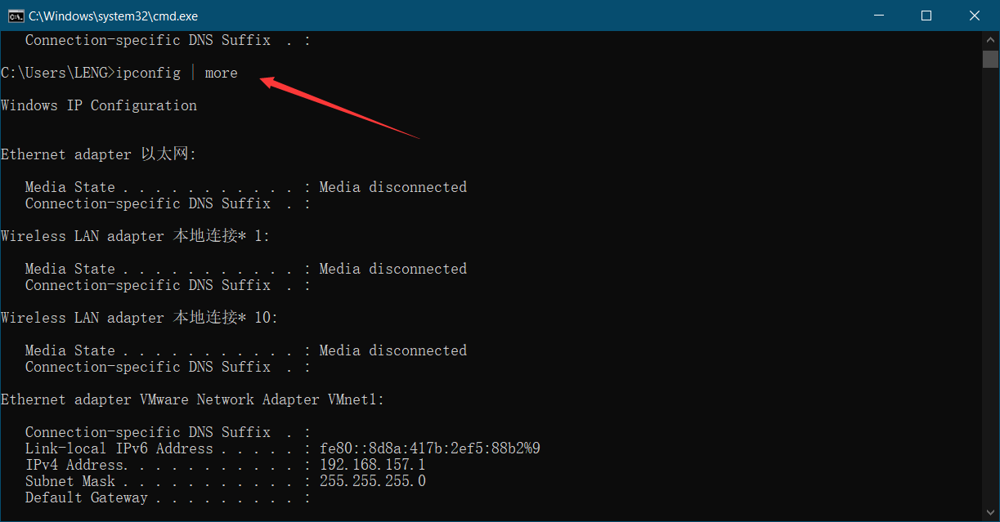

#### 测试是否联网

```
ping www.baidu.com #下面这样则证明连接通畅
```

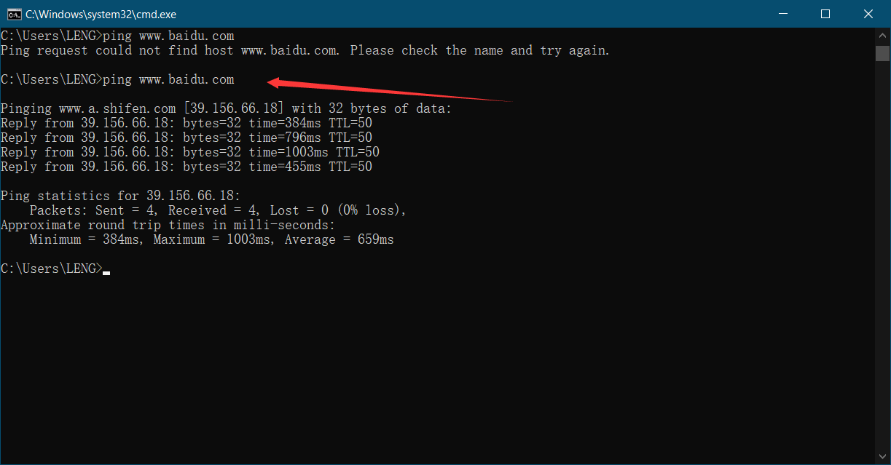

#### 查看目录下面内容

```
dir #类似于linux下的ls
```

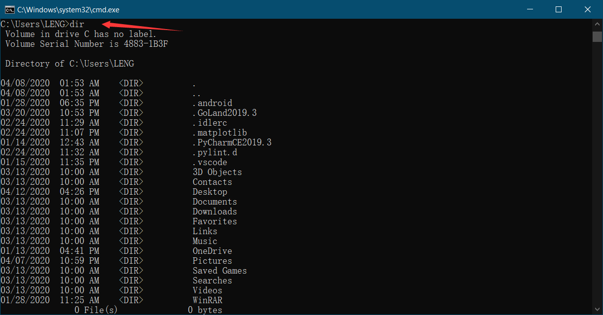

#### 查看目录结构

```
tree | more #和linux下的tree类似
```

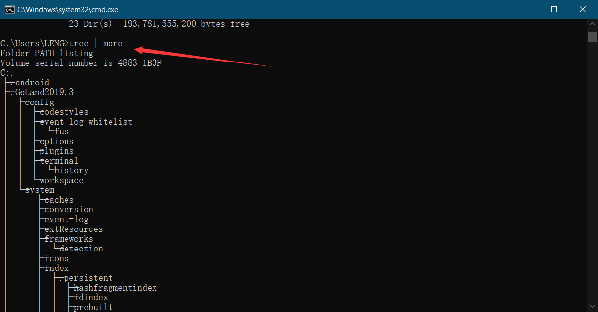

#### 进入文件夹

```
cd #和linux下的cd类似
```

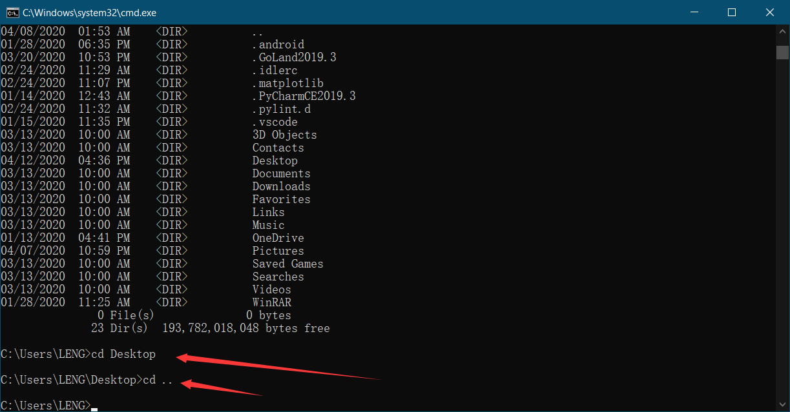

#### 关机

```
shutdown /s /t 0 #立刻关机
```

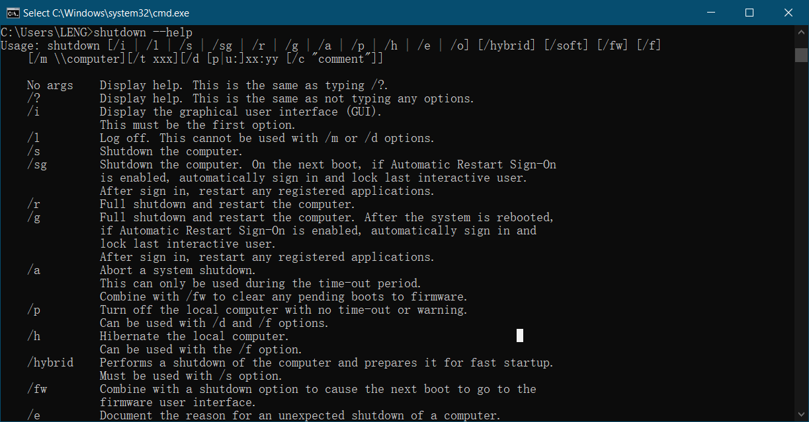

## Vi/Vim操作使用

vim键盘图

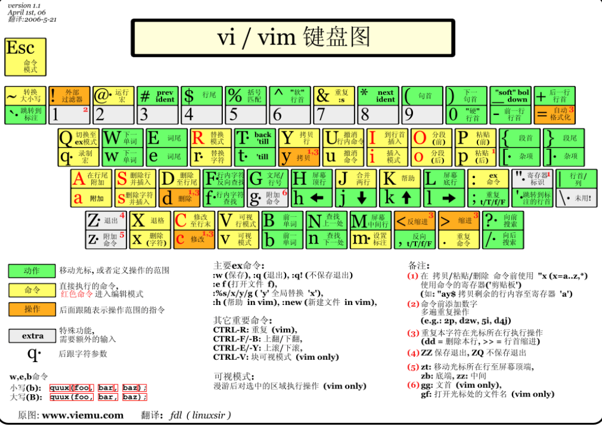

基本上 vi/vim 共分为三种模式，分别是**命令模式（Command mode）**，**输入模式（Insert mode）**和**底线命令模式（Last line mode）**。 这三种模式的作用分别是：

### 命令模式

用户刚刚启动 vi/vim，便进入了命令模式。

此状态下敲击键盘动作会被Vim识别为命令，而非输入字符。比如我们此时按下i，并不会输入一个字符，i被当作了一个命令。

以下是常用的几个命令：

- **i** 切换到输入模式，以输入字符。
- **x** 删除当前光标所在处的字符。
- **:** 切换到底线命令模式，以在最底一行输入命令。

若想要编辑文本：启动Vim，进入了命令模式，按下i，切换到输入模式。

命令模式只有一些最基本的命令，因此仍要依靠底线命令模式输入更多命令。

### 输入模式

在命令模式下按下i就进入了输入模式。

在输入模式中，可以使用以下按键：

- **字符按键以及Shift组合**，输入字符
- **ENTER**，回车键，换行
- **BACK SPACE**，退格键，删除光标前一个字符
- **DEL**，删除键，删除光标后一个字符
- **方向键**，在文本中移动光标
- **HOME**/**END**，移动光标到行首/行尾
- **Page Up**/**Page Down**，上/下翻页
- **Insert**，切换光标为输入/替换模式，光标将变成竖线/下划线
- **ESC**，退出输入模式，切换到命令模式

### 底线命令模式

在命令模式下按下:（英文冒号）就进入了底线命令模式。

底线命令模式可以输入单个或多个字符的命令，可用的命令非常多。

在底线命令模式中，基本的命令有（已经省略了冒号）：

- q 退出程序
- w 保存文件

按ESC键可随时退出底线命令模式。

### vi/vim 按键说明

除了上面简易范例的 i, Esc, :wq 之外，其实 vim 还有非常多的按键可以使用。

第一部分：一般模式可用的光标移动、复制粘贴、搜索替换等

| 移动光标的方法                                               |                                                              |
| :----------------------------------------------------------- | ------------------------------------------------------------ |
| h 或 向左箭头键(←)                                           | 光标向左移动一个字符                                         |
| j 或 向下箭头键(↓)                                           | 光标向下移动一个字符                                         |
| k 或 向上箭头键(↑)                                           | 光标向上移动一个字符                                         |
| l 或 向右箭头键(→)                                           | 光标向右移动一个字符                                         |
| 如果你将右手放在键盘上的话，你会发现 hjkl 是排列在一起的，因此可以使用这四个按钮来移动光标。 如果想要进行多次移动的话，例如向下移动 30 行，可以使用 "30j" 或 "30↓" 的组合按键， 亦即加上想要进行的次数(数字)后，按下动作即可！ |                                                              |
| [Ctrl] + [f]                                                 | 屏幕『向下』移动一页，相当于 [Page Down]按键 (常用)          |
| [Ctrl] + [b]                                                 | 屏幕『向上』移动一页，相当于 [Page Up] 按键 (常用)           |
| [Ctrl] + [d]                                                 | 屏幕『向下』移动半页                                         |
| [Ctrl] + [u]                                                 | 屏幕『向上』移动半页                                         |
| +                                                            | 光标移动到非空格符的下一行                                   |
| -                                                            | 光标移动到非空格符的上一行                                   |
| n<space>                                                     | 那个 n 表示『数字』，例如 20 。按下数字后再按空格键，光标会向右移动这一行的 n 个字符。例如 20<space> 则光标会向后面移动 20 个字符距离。 |
| 0 或功能键[Home]                                             | 这是数字『 0 』：移动到这一行的最前面字符处 (常用)           |
| $ 或功能键[End]                                              | 移动到这一行的最后面字符处(常用)                             |
| H                                                            | 光标移动到这个屏幕的最上方那一行的第一个字符                 |
| M                                                            | 光标移动到这个屏幕的中央那一行的第一个字符                   |
| L                                                            | 光标移动到这个屏幕的最下方那一行的第一个字符                 |
| G                                                            | 移动到这个档案的最后一行(常用)                               |
| nG                                                           | n 为数字。移动到这个档案的第 n 行。例如 20G 则会移动到这个档案的第 20 行(可配合 :set nu) |
| gg                                                           | 移动到这个档案的第一行，相当于 1G 啊！ (常用)                |
| n<Enter>                                                     | n 为数字。光标向下移动 n 行(常用)                            |
| 搜索替换                                                     |                                                              |
| /word                                                        | 向光标之下寻找一个名称为 word 的字符串。例如要在档案内搜寻 vbird 这个字符串，就输入 /vbird 即可！ (常用) |
| ?word                                                        | 向光标之上寻找一个字符串名称为 word 的字符串。               |
| n                                                            | 这个 n 是英文按键。代表重复前一个搜寻的动作。举例来说， 如果刚刚我们执行 /vbird 去向下搜寻 vbird 这个字符串，则按下 n 后，会向下继续搜寻下一个名称为 vbird 的字符串。如果是执行 ?vbird 的话，那么按下 n 则会向上继续搜寻名称为 vbird 的字符串！ |
| N                                                            | 这个 N 是英文按键。与 n 刚好相反，为『反向』进行前一个搜寻动作。 例如 /vbird 后，按下 N 则表示『向上』搜寻 vbird 。 |
| 使用 /word 配合 n 及 N 是非常有帮助的！可以让你重复的找到一些你搜寻的关键词！ |                                                              |
| :n1,n2s/word1/word2/g                                        | n1 与 n2 为数字。在第 n1 与 n2 行之间寻找 word1 这个字符串，并将该字符串取代为 word2 ！举例来说，在 100 到 200 行之间搜寻 vbird 并取代为 VBIRD 则： 『:100,200s/vbird/VBIRD/g』。(常用) |
| **:1,$s/word1/word2/g** 或 **:%s/word1/word2/g**             | 从第一行到最后一行寻找 word1 字符串，并将该字符串取代为 word2 ！(常用) |
| **:1,$s/word1/word2/gc** 或 **:%s/word1/word2/gc**           | 从第一行到最后一行寻找 word1 字符串，并将该字符串取代为 word2 ！且在取代前显示提示字符给用户确认 (confirm) 是否需要取代！(常用) |
| 删除、复制与贴上                                             |                                                              |
| x, X                                                         | 在一行字当中，x 为向后删除一个字符 (相当于 [del] 按键)， X 为向前删除一个字符(相当于 [backspace] 亦即是退格键) (常用) |
| nx                                                           | n 为数字，连续向后删除 n 个字符。举例来说，我要连续删除 10 个字符， 『10x』。 |
| dd                                                           | 删除游标所在的那一整行(常用)                                 |
| ndd                                                          | n 为数字。删除光标所在的向下 n 行，例如 20dd 则是删除 20 行 (常用) |
| d1G                                                          | 删除光标所在到第一行的所有数据                               |
| dG                                                           | 删除光标所在到最后一行的所有数据                             |
| d$                                                           | 删除游标所在处，到该行的最后一个字符                         |
| d0                                                           | 那个是数字的 0 ，删除游标所在处，到该行的最前面一个字符      |
| yy                                                           | 复制游标所在的那一行(常用)                                   |
| nyy                                                          | n 为数字。复制光标所在的向下 n 行，例如 20yy 则是复制 20 行(常用) |
| y1G                                                          | 复制游标所在行到第一行的所有数据                             |
| yG                                                           | 复制游标所在行到最后一行的所有数据                           |
| y0                                                           | 复制光标所在的那个字符到该行行首的所有数据                   |
| y$                                                           | 复制光标所在的那个字符到该行行尾的所有数据                   |
| p, P                                                         | p 为将已复制的数据在光标下一行贴上，P 则为贴在游标上一行！ 举例来说，我目前光标在第 20 行，且已经复制了 10 行数据。则按下 p 后， 那 10 行数据会贴在原本的 20 行之后，亦即由 21 行开始贴。但如果是按下 P 呢？ 那么原本的第 20 行会被推到变成 30 行。 (常用) |
| J                                                            | 将光标所在行与下一行的数据结合成同一行                       |
| c                                                            | 重复删除多个数据，例如向下删除 10 行，[ 10cj ]               |
| u                                                            | 复原前一个动作。(常用)                                       |
| [Ctrl]+r                                                     | 重做上一个动作。(常用)                                       |
| 这个 u 与 [Ctrl]+r 是很常用的指令！一个是复原，另一个则是重做一次～ 利用这两个功能按键，你的编辑，嘿嘿！很快乐的啦！ |                                                              |
| .                                                            | 不要怀疑！这就是小数点！意思是重复前一个动作的意思。 如果你想要重复删除、重复贴上等等动作，按下小数点『.』就好了！ (常用) |

第二部分：一般模式切换到编辑模式的可用的按钮说明

| 进入输入或取代的编辑模式                                     |                                                              |
| :----------------------------------------------------------- | ------------------------------------------------------------ |
| i, I                                                         | 进入输入模式(Insert mode)： i 为『从目前光标所在处输入』， I 为『在目前所在行的第一个非空格符处开始输入』。 (常用) |
| a, A                                                         | 进入输入模式(Insert mode)： a 为『从目前光标所在的下一个字符处开始输入』， A 为『从光标所在行的最后一个字符处开始输入』。(常用) |
| o, O                                                         | 进入输入模式(Insert mode)： 这是英文字母 o 的大小写。o 为『在目前光标所在的下一行处输入新的一行』； O 为在目前光标所在处的上一行输入新的一行！(常用) |
| r, R                                                         | 进入取代模式(Replace mode)： r 只会取代光标所在的那一个字符一次；R会一直取代光标所在的文字，直到按下 ESC 为止；(常用) |
| 上面这些按键中，在 vi 画面的左下角处会出现『--INSERT--』或『--REPLACE--』的字样。 由名称就知道该动作了吧！！特别注意的是，我们上面也提过了，你想要在档案里面输入字符时， 一定要在左下角处看到 INSERT 或 REPLACE 才能输入喔！ |                                                              |
| [Esc]                                                        | 退出编辑模式，回到一般模式中(常用)                           |

第三部分：一般模式切换到指令行模式的可用的按钮说明

| 指令行的储存、离开等指令                                     |                                                              |
| :----------------------------------------------------------- | ------------------------------------------------------------ |
| :w                                                           | 将编辑的数据写入硬盘档案中(常用)                             |
| :w!                                                          | 若文件属性为『只读』时，强制写入该档案。不过，到底能不能写入， 还是跟你对该档案的档案权限有关啊！ |
| :q                                                           | 离开 vi (常用)                                               |
| :q!                                                          | 若曾修改过档案，又不想储存，使用 ! 为强制离开不储存档案。    |
| 注意一下啊，那个惊叹号 (!) 在 vi 当中，常常具有『强制』的意思～ |                                                              |
| :wq                                                          | 储存后离开，若为 :wq! 则为强制储存后离开 (常用)              |
| ZZ                                                           | 这是大写的 Z 喔！若档案没有更动，则不储存离开，若档案已经被更动过，则储存后离开！ |
| :w [filename]                                                | 将编辑的数据储存成另一个档案（类似另存新档）                 |
| :r [filename]                                                | 在编辑的数据中，读入另一个档案的数据。亦即将 『filename』 这个档案内容加到游标所在行后面 |
| :n1,n2 w [filename]                                          | 将 n1 到 n2 的内容储存成 filename 这个档案。                 |
| :! command                                                   | 暂时离开 vi 到指令行模式下执行 command 的显示结果！例如 『:! ls /home』即可在 vi 当中察看 /home 底下以 ls 输出的档案信息！ |
| vim 环境的变更                                               |                                                              |
| :set nu                                                      | 显示行号，设定之后，会在每一行的前缀显示该行的行号           |
| :set nonu                                                    | 与 set nu 相反，为取消行号！                                 |

特别注意，在 vi/vim 中，数字是很有意义的！数字通常代表重复做几次的意思！ 也有可能是代表去到第几个什么什么的意思。

举例来说，要删除 50 行，则是用 『50dd』 数字加在动作之前，如我要向下移动 20 行呢？那就是『20j』或者是『20↓』即可。

## 管道

### **符号表示**

`|` 和管道特别形象。

### **作用**

管道是Linux中很重要的一种通信方式,是把一个程序的输出直接连接到另一个程序的输入,常说的管道多是指无名管道,无名管道只能用于具有亲缘关系的进程之间，这是它与有名管道的最大区别。
有名管道叫named pipe或者FIFO(先进先出)，可以用函数mkfifo()创建。

### **实现机制**

在Linux中，管道是一种使用非常频繁的通信机制。从本质上说，管道也是一种文件，但它又和一般的文件有所不同，管道可以克服使用文件进行通信的两个问题，具体表现为：

1. 限制管道的大小。实际上，管道是一个固定大小的缓冲区。在Linux中，该缓冲区的大小为1页，即4K字节，使得它的大小不象文件那样不加检验地增长。使用单个固定缓冲区也会带来问题，比如在写管道时可能变满，当这种情况发生时，随后对管道的write()调用将默认地被阻塞，等待某些数据被读取，以便腾出足够的空间供write()调用写。
2. 读取进程也可能工作得比写进程快。当所有当前进程数据已被读取时，管道变空。当这种情况发生时，一个随后的read()调用将默认地被阻塞，等待某些数据被写入，这解决了read()调用返回文件结束的问题。

注意：从管道读数据是一次性操作，数据一旦被读，它就从管道中被抛弃，释放空间以便写更多的数据。

### **管道的结构**

在 Linux 中，管道的实现并没有使用专门的数据结构，而是借助了文件系统的file结构和VFS的索引节点inode。通过将两个 file 结构指向同一个临时的 VFS 索引节点，而这个 VFS 索引节点又指向一个物理页面而实现的。

### **管道的读写**

管道实现的源代码在fs/pipe.c中，在pipe.c中有很多函数，其中有两个函数比较重要，即管道读函数pipe_read()和管道写函数pipe_wrtie()。管道写函数通过将字节复制到 VFS 索引节点指向的物理内存而写入数据，而管道读函数则通过复制物理内存中的字节而读出数据。当然，内核必须利用一定的机制同步对管道的访问，为此，内核使用了锁、等待队列和信号。
当写进程向管道中写入时，它利用标准的库函数write()，系统根据库函数传递的文件描述符，可找到该文件的 file 结构。file 结构中指定了用来进行写操作的函数（即写入函数）地址，于是，内核调用该函数完成写操作。写入函数在向内存中写入数据之前，必须首先检查 VFS 索引节点中的信息，同时满足如下条件时，才能进行实际的内存复制工作：
1.内存中有足够的空间可容纳所有要写入的数据；
2.内存没有被读程序锁定。
如果同时满足上述条件，写入函数首先锁定内存，然后从写进程的地址空间中复制数据到内存。否则，写入进程就休眠在 VFS 索 引节点的等待队列中，接下来，内核将调用调度程序，而调度程序会选择其他进程运行。写入进程实际处于可中断的等待状态，当内存中有足够的空间可以容纳写入 数据，或内存被解锁时，读取进程会唤醒写入进程，这时，写入进程将接收到信号。当数据写入内存之后，内存被解锁，而所有休眠在索引节点的读取进程会被唤醒。
管道的读取过程和写入过程类似。但是，进程可以在没有数据或内存被锁定时立即返回错误信息，而不是阻塞该进程，这依赖于文件或管道的打开模式。反之，进程可 以休眠在索引节点的等待队列中等待写入进程写入数据。当所有的进程完成了管道操作之后，管道的索引节点被丢弃，而共享数据页也被释放。
因为管道的实现涉及很多文件的操作,因此,当读者学完有关文件系统的内容后来读pipe.c中的代码，你会觉得并不难理解。
Linux 管道对阻塞之前一次写操作的大小有限制。 专门为每个管道所使用的内核级缓冲区确切为 4096 字节。 除非阅读器清空管道，否则一次超过 4K 的写操作将被阻塞。 实际上这算不上什么限制，因为读和写操作是在不同的线程中实现的。

### Linux中管道的使用

> 管道是一种通信机制，通常用于进程间的通信（也可通过socket进行网络通信），它表现出来的形式将前面每一个进程的输出（stdout）直接作为下一个进程的输入（stdin）。

管道命令使用`|`作为界定符号

- 管道命令仅能处理**standard output**,对于**standard error output**会予以忽略。
   `less,more,head,tail...都是可以接受standard input的命令，所以他们是管道命令`
   `ls,cp,mv并不会接受standard input的命令，所以他们就不是管道命令了。`
- 管道命令必须要能够接受来自前一个命令的数据成为**standard input**继续处理才行。

示例：

```ruby
$ ls -al /etc | less
```

通过管道将`ls -al`的输出作为 下一个命令`less`的输入，方便浏览。


## 重定向

我们知道，Linux 中标准的输入设备默认指的是键盘，标准的输出设备默认指的是显示器。

- 输入重定向：指的是重新指定设备来代替键盘作为新的输入设备；
- 输出重定向：指的是重新指定设备来代替显示器作为新的输出设备。

> 通常是用文件或命令的执行结果来代替键盘作为新的输入设备，而新的输出设备通常指的就是文件。

#### Linux输入重定向

对于输入重定向来说，其需要用到的符号以及作用如表 1 所示。

| 命令符号格式           | 作用                                                         |
| ---------------------- | ------------------------------------------------------------ |
| 命令 < 文件            | 将指定文件作为命令的输入设备                                 |
| 命令 << 分界符         | 表示从标准输入设备（键盘）中读入，直到遇到分界符才停止（读入的数据不包括分界符），这里的分界符其实就是自定义的字符串 |
| 命令 < 文件 1 > 文件 2 | 将文件 1 作为命令的输入设备，该命令的执行结果输出到文件 2 中。 |


【例 1】
默认情况下，cat 命令会接受标准输入设备（键盘）的输入，并显示到控制台，但如果用文件代替键盘作为输入设备，那么该命令会以指定的文件作为输入设备，并将文件中的内容读取并显示到控制台。

以 /etc/passwd 文件（存储了系统中所有用户的基本信息）为例，执行如下命令：

```bash
[root@localhost ~]# cat /etc/passwd
#这里省略输出信息，读者可自行查看
[root@localhost ~]# cat < /etc/passwd
#输出结果同上面命令相同
```

注意，虽然执行结果相同，但第一行代表是以键盘作为输入设备，而第二行代码是以 /etc/passwd 文件作为输入设备。

【例 2】

```bash
[root@localhost ~]# cat << 0
>c.biancheng.net
>Linux
>0
c.biancheng.net
Linux
```

可以看到，当指定了 0 作为分界符之后，只要不输入 0，就可以一直输入数据。

【例 3】
首先，新建文本文件 a.tx，然后执行如下命令：

```bash
[root@localhost ~]# cat a.txt
[root@localhost ~]# cat < /etc/passwd > a.txt
[root@localhost ~]# cat a.txt
#输出了和 /etc/passwd 文件内容相同的数据
```

可以看到，通过重定向 /etc/passwd 作为输入设备，并输出重定向到 a.txt，最终实现了将 /etc/passwd 文件中内容复制到 a.txt 中。

#### Linux输出重定向

相较于输入重定向，我们使用输出重定向的频率更高。并且，和输入重定向不同的是，输出重定向还可以细分为标准输出重定向和错误输出重定向两种技术。

例如，使用 ls 命令分别查看两个文件的属性信息，但其中一个文件是不存在的，如下所示：

```bash
[root@localhost ~]# touch demo1.txt
[root@localhost ~]# ls -l demo1.txt
-rw-rw-r--. 1 root root 0 Oct 12 15:02 demo1.txt
[root@localhost ~]# ls -l demo2.txt  <-- 不存在的文件
ls: cannot access demo2.txt: No such file or directory
```

上述命令中，demo1.txt 是存在的，因此正确输出了该文件的一些属性信息，这也是该命令执行的标准输出信息；而 demo2.txt 是不存在的，因此执行 ls 命令之后显示的报错信息，是该命令的错误输出信息。

> 再次强调，要想把原本输出到屏幕上的数据转而写入到文件中，这两种输出信息就要区别对待。

在此基础上，标准输出重定向和错误输出重定向又分别包含清空写入和追加写入两种模式。因此，对于输出重定向来说，其需要用到的符号以及作用如表 2 所示。


| 命令符号格式                         | 作用                                                         |
| ------------------------------------ | ------------------------------------------------------------ |
| 命令 > 文件                          | 将命令执行的标准输出结果重定向输出到指定的文件中，如果该文件已包含数据，会清空原有数据，再写入新数据。 |
| 命令 2> 文件                         | 将命令执行的错误输出结果重定向到指定的文件中，如果该文件中已包含数据，会清空原有数据，再写入新数据。 |
| 命令 >> 文件                         | 将命令执行的标准输出结果重定向输出到指定的文件中，如果该文件已包含数据，新数据将写入到原有内容的后面。 |
| 命令 2>> 文件                        | 将命令执行的错误输出结果重定向到指定的文件中，如果该文件中已包含数据，新数据将写入到原有内容的后面。 |
| 命令 >> 文件 2>&1 或者 命令 &>> 文件 | 将标准输出或者错误输出写入到指定文件，如果该文件中已包含数据，新数据将写入到原有内容的后面。注意，第一种格式中，最后的 2>&1 是一体的，可以认为是固定写法。 |


【例 4】新建一个包含有 "Linux" 字符串的文本文件 Linux.txt，以及空文本文件 demo.txt，然后执行如下命令：

```bash
[root@localhost ~]# cat Linux.txt > demo.txt
[root@localhost ~]# cat demo.txt
Linux
[root@localhost ~]# cat Linux.txt > demo.txt
[root@localhost ~]# cat demo.txt
Linux   <--这里的 Linux 是清空原有的 Linux 之后，写入的新的 Linux
[root@localhost ~]# cat Linux.txt >> demo.txt
[root@localhost ~]# cat demo.txt
Linux
Linux   <--以追加的方式，新数据写入到原有数据之后
[root@localhost ~]# cat b.txt > demo.txt
cat: b.txt: No such file or directory <-- 错误输出信息依然输出到了显示器中
[root@localhost ~]# cat b.txt 2> demo.txt
[root@localhost ~]# cat demo.txt
cat: b.txt: No such file or directory <--清空文件，再将错误输出信息写入到该文件中
[root@localhost ~]# cat b.txt 2>> demo.txt
[root@localhost ~]# cat demo.txt
cat: b.txt: No such file or directory
cat: b.txt: No such file or directory <--追加写入错误输出信息
```


## 其他

分屏：竖屏- vim -O   横屏- vim -o   切换- ctrl +w w   sp  vs

```bash

!$ #找上一步最后一个参数
!! #上一个命令
echo $? #上一条命令的返回值 0-正确 非0-错误
!#加history里行号直接执行该命令
stat #查看创建文件、修改文件的时间
cp #复制文件
mv #移动文件位置、改名
ls -a #查看隐藏文件
find / -name='sang'#查找sang
chmod #设置文件权限
sudo #更改用户
cat #连接文件并打印到标准输出设备
> #输入定向 （覆盖）
>> #输入定向（追加）
<< #输出定向
cat >> xx<<EOF(可自定义)#打印XX内容到屏幕 可输入内容到XX 输EOF则退出该命令
cat /dev/null> /etc/test.txt #/etc/test.txt文档内容
| #管道-文件输入通道
mknod name p #创建管道
fg
bg
kill %1
su #切换用户，只切换了root身份，还是普通用户的shell
su - #连用户和shell环境一起切换成root用户了
rename #重命名
VIM操作
dw #删一个单词
shift v#行模式
ctrl v# 列模式
ps -ef 
ps
pstree

```

  

# C/C++嵌入式代码编写部分

## 文件操作

### 文件描述符是什么

文件描述符是一个非负的索引值（一般从3开始，0、1、2已经被使用），指向内核中的 “文件记录表”，内核为进程中要打开的文件维护者一个“文件记录表；

当打开一个现存文件或创建一个新文件时，内核就向进程返回一个文件描述符（内核记录表某一栏的索引）；
当需要读写文件时，也需要把文件描述符作为参数传递给相应的函数。
Linux 下所有对设备和文件的操作都使用文件描述符来进行。

### 常见的文件描述符类型

一个进程启动时，会默认打开三个文件–标准输入、标准输出和标准出错处理。

- 0：表示标准输入，对应宏为：STDIN_FILENO，函数 scanf() 使用的是标准输入；

- 1：表示标准输出，对应宏为：STDOUT_FILENO， 函数 printf() 使用的是标准输出；

- 2：表示标准出错处理，对应的宏为：STDERR_NO；

你也可以使用函数 fscanf() 和 fprintf() 使用不同的 文件描述符 重定向进程的 I/O 到不同的文件。

### 使用文件描述符的函数

若要访问文件，而且调用的函数又是 write、read、open和close时，就必须用到文件描述符（一般从3开始）。
若调用的函数为 fwrite、fread、fopen和fclose时，就可以绕过直接控制文件描述符，使用的则是与文件描述符对应的文件流。

### 文件描述符的创建

进程获取文件描述符最常见的方法就是通过系统函数open或create获取，或者是从父进程继承。 
从父进程继承的话，子进程就可以访问父进程所使用的文件。我们再深入想想，进程是独立运行的，互不干扰，如果父子进程要通信的话，是不是就可以通过这些都能访问的文件入手。 
文件描述符对于每一个进程是唯一的，每个进程都有一张文件描述符表，用于管理文件描述符。当使用fork创建子进程的话，子进程会获得父进程所有文件描述符的副本，这些文件描述符在执行fork时打开。在由fcntl、dup和dup2子例程复制或拷贝某个进程时，会发生同样的复制过程。

### fork对文件描述符的影响

fork会导致子进程继承父进程打开的文件描述符，其本质是将父进程的整个文件描述符表复制一份，放到子进程的PCB中。因此父、子进程中相同文件描述符（文件描述符为整数）指向的是同一个文件表元素，这将导致父（子）进程读取文件后，子（父）进程将读取同一文件的后续内容。

```c
int main(void)  
{  
       int fd, pid, status;  
       char buf[10];  
         if ((fd = open("./test.txt", O_RDONLY)) < 0) {  
                 perror("open");  exit(-1);  
        }  
         if ((pid = fork()) < 0) {  
               perror("fork");  exit(-1);  
        } else if (pid == 0) {  //child  
                read(fd, buf, 2);  
                write(STDOUT_FILENO, buf, 2);  
        } else {  //parent  
                 sleep(2);  
                lseek(fd, SEEK_CUR, 1);  
                read(fd, buf, 3);  
                 write(STDOUT_FILENO, buf, 3);  
                 write(STDOUT_FILENO, "\n", 1);  
        }  
         return 0;  
 }  
```

假设，./test.txt的内容是abcdefg。那么子进程的18行将读到字符ab；由于，父、子进程的文件描述符fd都指向同一个文件表元素，因此当父进程执行23行时，fd对应的文件的读写指针将移动到字符d，而不是字符b，从而24行读到的是字符def，而不是字符bcd。程序运行的最终结果是打印abdef，而不是abbcd


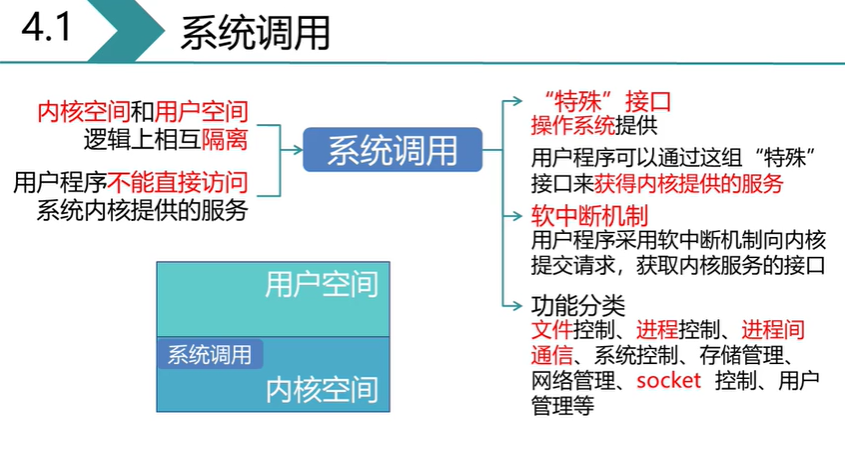

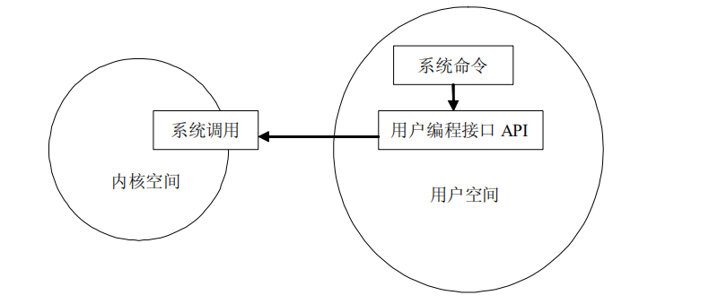

对于 Linux 而言，所有对设备和文件的操作都使用文件描述符来进行的。文件描述符是一个非负的整数，它是一个索引值，并指向内核中每个进程打开文件的记录表。当打开一个现存文件或创建一个新文件时，内核就向进程返回一个文件描述符；当需要读写文件时， 也需要把文件描述符作为参数传递给相应的函数。

通常，一个进程启动时，都会打开 3 个文件：标准输入、标准输出和标准出错处理。这 3 个文件分别对应文件描述符为 0、1 和 2（也就是宏替换 STDIN_FILENO、STDOUT_FILENO和 STDERR_FILENO，鼓励读者使用这些宏替换）

### open 函数

作用：

打开或创建文件
可指定文件属性及用户权限等参数

函数原型

```c
int  open(const  char *pathname,  flags,  int perms)
```

| 所需头文件                         | #include <sys/types.h>,<sys/stat.h>,<fcntl.h>    |          |
| ---------------------------------- | ------------------------------------------------ | -------- |
| 函数原型                           | int open(const char *pathname, flags, int perms) |          |
| 函数传入值                         | pathname                                         | 文件名称 |
| flag:文件打开方式                  | O_RDONLY:O_WRONLY:O_RDWR                         |          |
| O_CREAT\|O_EXCL\|O_TRUNC\|O_APPEND |                                                  |          |
| perms                              | S_I(R/W/X/USER/GRP/OTH), 8进制存取权限           |          |
| 函数返回值                         | 成功：返回文件描述符（0，1，2，3，4……）          |          |
| 失败：-1                           |                                                  |          |

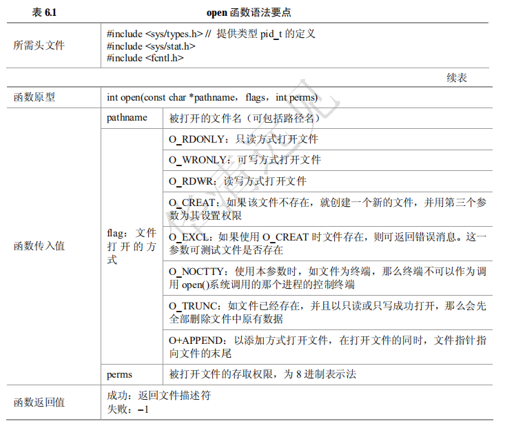

### close 函数

关闭一个已经打开的文件描述符
进程结束，它所有已打开的文件描述符都由内核自动关闭


### open/close函数代码示例

```c
/*open.c*/
#include <unistd.h>
#include <sys/types.h>
#include <sys/stat.h>
#include <fcntl.h>
#include <stdlib.h>
#include <stdio.h>
int main(void)
{
    int fd;
    /*调用 open 函数，以可读写的方式打开，注意选项可以用“|”符号连接*/
    if ((fd = open("/tmp/hello.c", O_CREAT | O_TRUNC | O_WRONLY, 0600)) < 0)
    {
        perror("open:");
        exit(1);
    }
    else
    {
        printf("Open file: hello.c %d\n", fd);
    }
    if (close(fd) < 0)
    {
        perror("close:");
        exit(1);
    }
    else
        printf("Close hello.c\n");
    exit(0);
}
```

### read 函数

从文件描述符中读数据
从终端设备文件读数据时，通常一次最多读一行

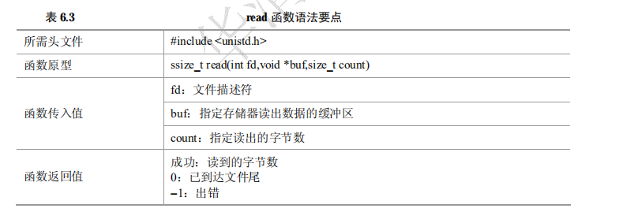

### write 函数

向文件描述符中写数据，从当前写指针处开始
若磁盘已满或超出该文件的长度，则write 函数返回失败


### lseek 函数

文件读写指针定位到文件描述符相应位置

在写普通文件时，写操作从文件的当前位移处开始

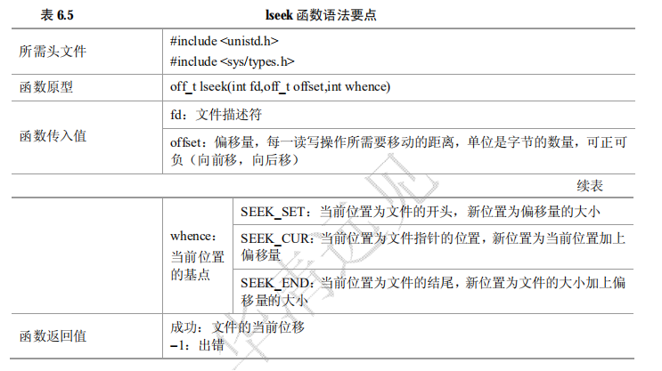

### 文件读写锁是什么

在文 件已经共享的情况下如何操作，也就是当多个用户共同使用、操作一个文件的情况，这时， Linux 通常采用的方法是给文件上锁，来避免共享的资源产生竞争的状态。

文件锁包括建议性锁和强制性锁。建议性锁要求每个上锁文件的进程都要检查是否有锁 存在，并且尊重已有的锁。在一般情况下，内核和系统都不使用建议性锁。强制性锁是由内核执行的锁，当一个文件被上锁进行写入操作的时候，内核将阻止其他任何文件对其进行读写操作。采用强制性锁对性能的影响很大，每次读写操作都必须检查是否有锁存在。

在 Linux 中，实现文件上锁的函数有 lock 和 fcntl，其中 flock 用于对文件施加建议性锁， 而 fcntl 不仅可以施加建议性锁，还可以施加强制锁。同时，fcntl 还能对文件的某一记录进行 上锁，也就是记录锁。

记录锁又可分为读取锁和写入锁，其中读取锁又称为共享锁，它能够使多个进程都能在文件的同一部分建立读取锁。而写入锁又称为排斥锁，在任何时刻只能有一个进程在文件的 某个部分上建立写入锁。当然，在文件的同一部分不能同时建立读取锁和写入锁。

### fcntl 函数

不仅可施加建议性锁，还可施加强制锁
还能对文件的某一记录进行上锁，即记录锁

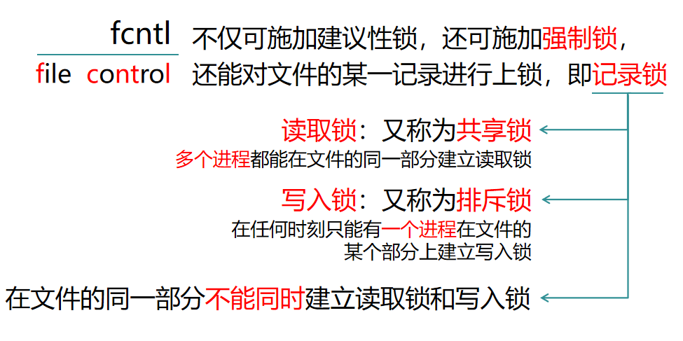

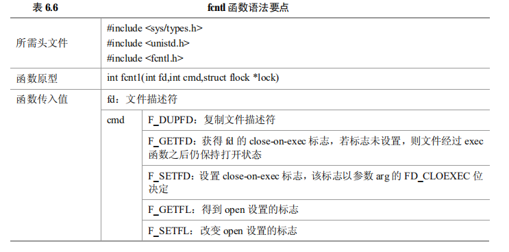

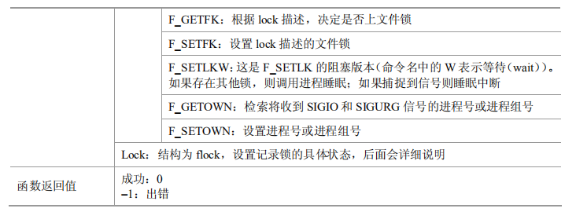

```c
//lock 的结构
Struct flock{ 
short l_type; 
off_t l_start; 
short l_whence; 
off_t l_len; 
pid_t l_pid; 
}
```

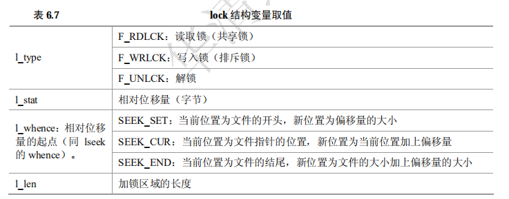

### IO 多路复用

#### 什么是 IO 多路复用

一句话解释：单线程或单进程同时监测若干个文件描述符是否可以执行 IO 操作的能力。

####  解决什么问题

应用程序通常需要处理来自多条事件流中的事件，比如我现在用的电脑，需要同时处理键盘鼠标的输入、中断信号等等事件，再比如 web 服务器如 nginx，需要同时处理来来自 N 个客户端的事件。

> 逻辑控制流在时间上的重叠叫做 **并发**

而 CPU 单核在同一时刻只能做一件事情，一种解决办法是对 CPU 进行时分复用(多个事件流将 CPU 切割成多个时间片，不同事件流的时间片交替进行)。在计算机系统中，我们用线程或者进程来表示一条执行流，通过不同的线程或进程在操作系统内部的调度，来做到对 CPU 处理的时分复用。这样多个事件流就可以并发进行，不需要一个等待另一个太久，在用户看起来他们似乎就是并行在做一样。

但凡事都是有成本的。线程 /进程也一样，有这么几个方面：

1. 线程 /进程创建成本
2. CPU 切换不同线程 /进程成本 [Context Switch](https://en.wikipedia.org/wiki/Context_switch)
3. 多线程的资源竞争

有没有一种可以在单线程 /进程中处理多个事件流的方法呢？一种答案就是 IO 多路复用。

因此 IO 多路复用解决的本质问题是在**用更少的资源完成更多的事**。

为了更全面的理解，先介绍下在 Linux 系统下所有 IO 模型。

#### I/O 模型

目前 Linux 系统中提供了 5 种 IO 处理模型

1. 阻塞 IO
2. 非阻塞 IO
3. IO 多路复用
4. 信号驱动 IO
5. 异步 IO

##### 阻塞 IO

这是最常用的简单的 IO 模型。阻塞 IO 意味着当我们发起一次 IO 操作后一直等待成功或失败之后才返回，在这期间程序不能做其它的事情。阻塞 IO 操作只能对单个文件描述符进行操作，详见[read](http://man7.org/linux/man-pages/man2/read.2.html)或[write](http://man7.org/linux/man-pages/man2/write.2.html)。

##### 非阻塞 IO

我们在发起 IO 时，通过对文件描述符设置 O_NONBLOCK flag 来指定该文件描述符的 IO 操作为非阻塞。非阻塞 IO 通常发生在一个 for 循环当中，因为每次进行 IO 操作时要么 IO 操作成功，要么当 IO 操作会阻塞时返回错误 EWOULDBLOCK/EAGAIN，然后再根据需要进行下一次的 for 循环操作，这种类似轮询的方式会浪费很多不必要的 CPU 资源，是一种糟糕的设计。和阻塞 IO 一样，非阻塞 IO 也是通过调用[read](http://man7.org/linux/man-pages/man2/read.2.html)或 write[write](http://man7.org/linux/man-pages/man2/write.2.html)来进行操作的，也只能对单个描述符进行操作。

##### IO 多路复用

IO 多路复用在 Linux 下包括了三种，[select](http://man7.org/linux/man-pages/man2/select.2.html)、[poll](http://man7.org/linux/man-pages/man2/poll.2.html)、[epoll](http://man7.org/linux/man-pages/man7/epoll.7.html)，抽象来看，他们功能是类似的，但具体细节各有不同：首先都会对一组文件描述符进行相关事件的注册，然后阻塞等待某些事件的发生或等待超时。更多细节详见下面的 "具体怎么用"。IO 多路复用都可以关注多个文件描述符，但对于这三种机制而言，不同数量级文件描述符对性能的影响是不同的，下面会详细介绍。

##### 信号驱动 IO

[信号驱动 IO](http://man7.org/linux/man-pages/man7/signal.7.html)是利用信号机制，让内核告知应用程序文件描述符的相关事件。这里有一个信号驱动 IO 相关的[例子](https://github.com/troydhanson/network/blob/master/tcp/server/sigio-server.c)。

但信号驱动 IO 在网络编程的时候通常很少用到，因为在网络环境中，和 socket 相关的读写事件太多了，比如下面的事件都会导致 SIGIO 信号的产生：

1. TCP 连接建立
2. 一方断开 TCP 连接请求
3. 断开 TCP 连接请求完成
4. TCP 连接半关闭
5. 数据到达 TCP socket
6. 数据已经发送出去(如：写 buffer 有空余空间)

上面所有的这些都会产生 SIGIO 信号，但我们没办法在 SIGIO 对应的信号处理函数中区分上述不同的事件，SIGIO 只应该在 IO 事件单一情况下使用，比如说用来监听端口的 socket，因为只有客户端发起新连接的时候才会产生 SIGIO 信号。

##### 异步 IO

异步 IO 和信号驱动 IO 差不多，但它比信号驱动 IO 可以多做一步：相比信号驱动 IO 需要在程序中完成数据从用户态到内核态(或反方向)的拷贝，异步 IO 可以把拷贝这一步也帮我们完成之后才通知应用程序。我们使用aio_read 来读，aio_write 写。

> 同步 IO vs 异步 IO
>
> 1. 同步 IO 指的是程序会一直阻塞到 IO 操作如 read 、write 完成
> 2. 异步 IO 指的是 IO 操作不会阻塞当前程序的继续执行
>
> 所以根据这个定义，上面阻塞 IO 当然算是同步的 IO，非阻塞 IO 也是同步 IO，因为当文件操作符可用时我们还是需要阻塞的读或写，同理 IO 多路复用和信号驱动 IO 也是同步 IO，只有异步 IO 是完全完成了数据的拷贝之后才通知程序进行处理，没有阻塞的数据读写过程。

### select 函数


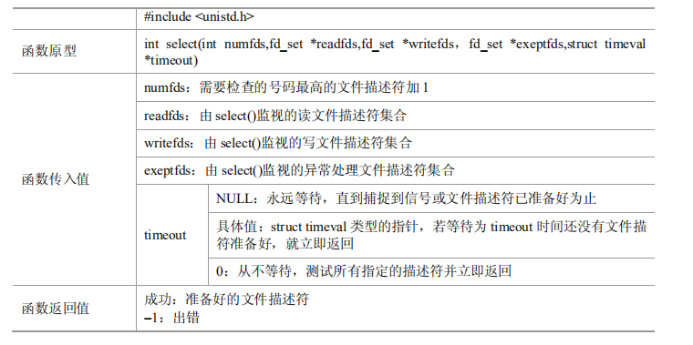

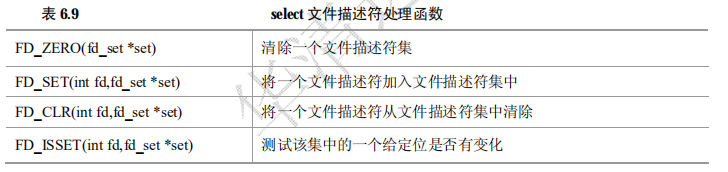

select 函数中的 timeout 是一个 struct timeval 类型的指针

```C
struct timeval { 
 	long tv_sec; /* second */ 
 	long tv_unsec; /* and microseconds*/ 
}
```

## 进程

### 进程的定义

进程的概念首先是在 60 年代初期由 MIT 的 Multics 系统和 IBM 的 TSS/360 系统引入的。经过了 40 多年的发展，人们对进程有过各种各样的定义。现列举较为著名的几种。

（1）进程是一个独立的可调度的活动（E. Cohen，D. Jofferson） 

（2）进程是一个抽象实体，当它执行某个任务时，将要分配和释放各种资源（P. Denning） 

（3）进程是可以并行执行的计算部分。（S. E. Madnick，J. T. Donovan）

以上进程的概念都不相同，但其本质是一样的。它指出了进程是一个程序的一次执行的过程。它和程序是有本质区别的，程序是静态的，它是一些保存在磁盘上的指令的有序集合， 没有任何执行的概念；而进程是一个动态的概念，它是程序执行的过程，包括了动态创建、调度和消亡的整个过程。它是程序执行和资源管理的最小单位。因此，对系统而言，当用户在系统中键入命令执行一个程序的时候，它将启动一个进程。

### 进程控制块

进程是 Linux 系统的基本调度单位，那么从系统的角度看如何描述并表示它的变化呢？在这里，是通过进程控制块来描述的。进程控制块包含了进程的描述信息、控制信息以及资 源信息，它是进程的一个静态描述。在 Linux 中，进程控制块中的每一项都是一个 task_struct结构，它是在 include/linux/sched.h 中定义的。

### 进程的标识

在 Linux 中最主要的进程标识有进程号（PID，Process Idenity Number）和它的父进程号 （PPID，parent process ID）。其中 PID 惟一地标识一个进程。PID 和 PPID 都是非零的正整数。 在 Linux 中获得当前进程的 PID 和 PPID 的系统调用函数为 getpid 和 getppid，通常程序获得当前进程的 PID 和 PPID 可以将其写入日志文件以做备份。

### fork 函数

fork 函数用于从已存在进程中创建一个新进程。新进程称为子进程，而原进程称为父进程。这两个分别带回它们各自的返回值，其中父进程的返回值是子进程的进程号，而子进程则返回 0。因此，可以通过返回值来判定该进程是父进程还是子进程。

使用 fork 函数得到的子进程是父进程的一个复制品，它从父进程处继承了整个进程的地址空间，包括进程上下文、进程堆栈、内存信息、打开的文件描述符、信号控制设定、进程优先级、进程组号、当前工作目录、根目录、资源限制、控制终端等，而子进程所独有的只 有它的进程号、资源使用和计时器等。因此可以看出，使用 fork 函数的代价是很大的，它复制了父进程中的代码段、数据段和堆栈段里的大部分内容，使得 fork 函数的执行速度并不很快。

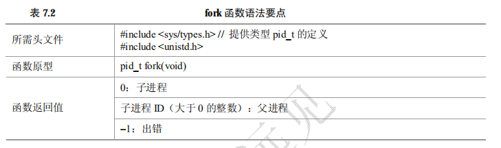

### exec 函数族

fork 函数是用于创建一个子进程，该子进程几乎拷贝了父进程的全部内容，但是，这个新创建的进程如何执行呢？这个 exec 函数族就提供了一个在进程中启动另一个程序执行的 方法。它可以根据指定的文件名或目录名找到可执行文件，并用它来取代原调用进程的数据段、代码段和堆栈段，在执行完之后，原调用进程的内容除了进程号外，其他全部被新的进程替换了。另外，这里的可执行文件既可以是二进制文件，也可以是 Linux 下任何可执行的 脚本文件。

在 Linux 中使用 exec 函数族主要有两种情况：

- 当进程认为自己不能再为系统和用户做出任何贡献时，就可以调用任何 exec 函数族 让自己重生； 

- 如果一个进程想执行另一个程序，那么它就可以调用 fork 函数新建一个进程，然后调用任何一个 exec，这样看起来就好像通过执行应用程序而产生了一个新进程。

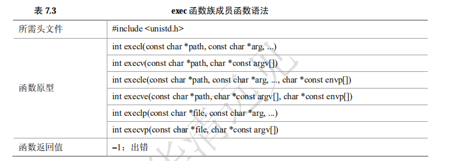

查找方式：

前 4 个函数的查找方式都是完整的文件目录路径，而最后2 个函数（也就是以 p 结尾的两个函数）可以只给出文件名，系统就会自动从环境变量“$PATH” 所指出的路径中进行查找。 

参数传递方式：

exec 函数族的参数传递有两种方式：一种是逐个列举的方式，而另一种则是将所有参数整体构造指针数组传递。 

在这里是以函数名的第 5 位字母来区分的，字母为“l”（list）的表示逐个列举的方式，其语法为 char *arg；字母为“v”（vertor）的表示将所有参数整体构造指针数组传递，其语法为*const argv[]。读者可以观察 execl、execle、execlp 的语法与 execv、execve、execvp 的区别。 

这里的参数实际上就是用户在使用这个可执行文件时所需的全部命令选项字符串（包括该可执行程序命令本身）。要注意的是，这些参数必须以 NULL 表示结束，如果使用逐个列举方式，那么要把它强制转化成一个字符指针，否则 exec 将会把它解释为一个整型参数，如果一个整型数的长度 char *的长度不同，那么 exec 函数就会报错。

环境变量 ：

exec 函数族可以默认系统的环境变量，也可以传入指定的环境变量。这里以“e” （Enviromen）结尾的两个函数 execle、execve 就可以在 envp[]中指定当前进程所使用的环境变量。

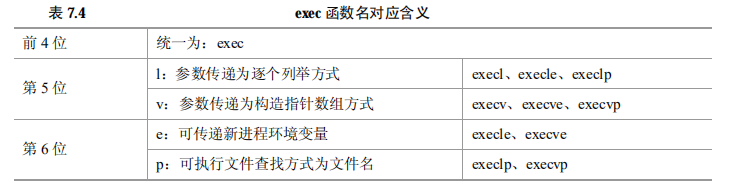

exec 函数族使用注意点：

在使用 exec 函数族时，一定要加上错误判断语句。因为 exec 很容易执行失败，其中最

常见的原因有： 

- 找不到文件或路径，此时 errno 被设置为 ENOENT； 

- 数组 argv 和 envp 忘记用 NULL 结束，此时 errno 被设置为 EFAULT； 

- 没有对应可执行文件的运行权限，此时 errno 被设置为 EACCES。

### exit 和_exit 函数


exit 和__exit 函数都是用来终止进程的。当程序执行到 _exit 或_exit 时，进程会无条件地停 止剩下的所有操作，清除包括 PCB 在内的各种数据结构，并终止本进程的运行。但是，这两 个函数还是有区别的，这两个函数的调用过程如图 所示

 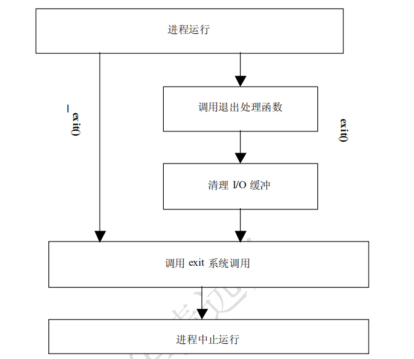

从图中可以看出，_exit()函数的作用是：直接使进程停止运行，清除其使用的内存空间， 并清除其在内核中的各种数据结构；exit()函数则在这些基础上作了一些包装，在执行退出之 前加了若干道工序。exit()函数与_exit()函数最大的区别就在于 exit()函数在调用 exit 系统之前要检查文件的打开情况，把文件缓冲区中的内容写回文件，就是图中的“清理 I/O 缓冲” 一项。

由于在 Linux 的标准函数库中，有一种被称作“缓冲 I/O（buffered I/O）”操作，其特征 就是对应每一个打开的文件，在内存中都有一片缓冲区。每次读文件时，会连续读出若干条 记录，这样在下次读文件时就可以直接从内存的缓冲区中读取；同样，每次写文件的时候， 也仅仅是写入内存中的缓冲区，等满足了一定的条件（如达到一数量或遇到特定字符等）， 再将缓冲区中的内容一次性写入文件。

这种技术大大增加了文件读写的速度，但也为编程带来了一点麻烦。比如有一些数据， 认为已经写入了文件，实际上因为没有满足特定的条件，它们还只是保存在缓冲区内，这时用_exit()函数直接将进程关闭，缓冲区中的数据就会丢失。因此，若想保证数据的完整性， 就一定要使用 exit()函数。 

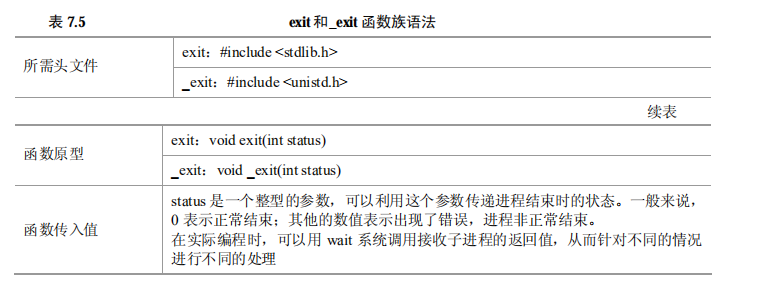

### wait 和 waitpid 函数

wait 函数是用于使父进程（也就是调用 wait 的进程）阻塞，直到一个子进程结束或者该进程接到了一个指定的信号为止。如果该父进程没有子进程或者他的子进程已经结束，则 wait就会立即返回。 

waitpid 的作用和 wait 一样，但它并不一定要等待第一个终止的子进程，它还有若干选项，如可提供一个非阻塞版本的 wait 功能，也能支持作业控制。实际上 wait 函数只是 waitpid 函 数的一个特例，在 Linux 内部实现 wait 函数时直接调用的就是 waitpid 函数。 

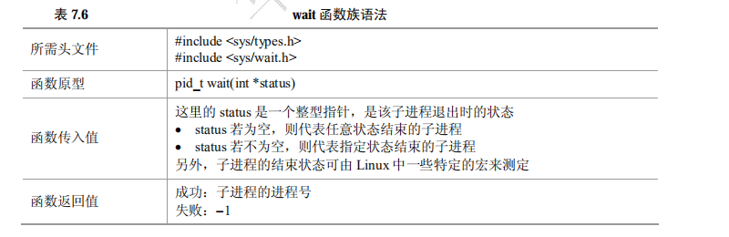


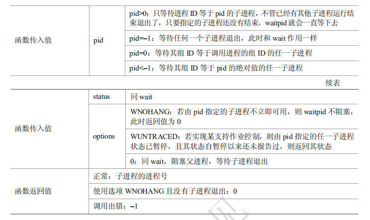

### waitpid 使用实例

本例中首先使用 fork新建一子进程，然后让其子进程暂停 5s（使用了 sleep 函数）。接下来对原有的父进程使用 waitpid 函数，并使用参数 WNOHANG 使该父进程不会阻塞。若有子进程退出，则 waitpid返回子进程号；若没有子进程退出，则 waitpid 返回 0，并且父进程每隔一秒循环判断一次。 


```c
/*waitpid.c*/
#include <sys/types.h>
#include <sys/wait.h>
#include <unistd.h>
#include <stdio.h>
#include <stdlib.h>
int main()
{
    pid_t pc, pr;
    pc = fork();
    if (pc < 0)
        printf("Error fork.\n");
    /*子进程*/
    else if (pc == 0)
    {
        /*子进程暂停 5s*/
        sleep(5);
        /*子进程正常退出*/
        exit(0);
    }
    /*父进程*/
    else
    {
        /*循环测试子进程是否退出*/
        do
        {
            /*调用 waitpid，且父进程不阻塞*/
            pr = waitpid(pc, NULL, WNOHANG);
            /*若子进程还未退出，则父进程暂停 1s*/
            if (pr == 0)
            {
                printf("The child process has not exited\n");
                sleep(1);
            }
        } while (pr == 0);
        /*若发现子进程退出，打印出相应情况*/
        if (pr == pc)
            printf("Get child %d\n", pr);
        else
            printf("some error occured.\n");
    }
}
```

### Linux 守护进程

守护进程，也就是通常所说的 Daemon 进程，是 Linux 中的后台服务进程。它是一个生 存期较长的进程，通常独立于控制终端并且周期性地执行某种任务或等待处理某些发生的事件。守护进程常常在系统引导装入时启动，在系统关闭时终止。Linux 系统有很多守护进程，大多数服务都是通过守护进程实现的，如本书在第二章中讲到的系统服务都是守护进程。同 时，守护进程还能完成许多系统任务，例如，作业规划进程 crond、打印进程 lqd 等（这里的 结尾字母 d 就是 Daemon 的意思）。 

由于在 Linux 中，每一个系统与用户进行交流的界面称为终端，每一个从此终端开始运 行的进程都会依附于这个终端，这个终端就称为这些进程的控制终端，当控制终端被关闭时， 相应的进程都会自动关闭。但是守护进程却能够突破这种限制，它从被执行开始运转，直到整个系统关闭时才会退出。如果想让某个进程不因为用户或终端或其他的变化而受到影响，那么就必须把这个进程变成一个守护进程。

#### 创建一个守护进程

##### 创建子进程，父进程退出

这是编写守护进程的第一步。由于守护进程是脱离控制终端的，因此，完成第一步后就会在 Shell 终端里造成一程序已经运行完毕的假象。之后的所有工作都在子进程中完成，而用户在 Shell 终端里则可以执行其他的命令，从而在形式上做到了与控制终端的脱离。父进程创建了子进程，而父进程又退出之后，此时该子进程不就没有父进程了吗？守护进程中确实会出现这么一个有趣的现象，由于父进程已经先于子进程退出，会造成子进程没有父进程，从而变成一个孤儿进程。在 Linux 中，每当系统发现一个孤儿进程，就会自动由 1 号进程（也就是 init 进程）收养它，这样，原先的子进程就会变成 init 进程的子进程了。

关键代码：

```c
/*父进程退出*/ 
pid=fork(); 
 if(pid>0){ 
 	exit(0); 
}
```

##### 在子进程中创建新会话

这个步骤是创建守护进程中最重要的一步，虽然它的实现非常简单，但它的意义却非常重大。在这里使用的是系统函数 setsid，在具体介绍 setsid 之前，读者首先要了解两个概念：进程组和会话期。

- 进程组

进程组是一个或多个进程的集合。进程组由进程组 ID 来惟一标识。除了进程号（PID） 之外，进程组 ID 也一个进程的必备属性。 每个进程组都有一个组长进程，其组长进程的进程号等于进程组 ID。且该进程 ID 不会 因组长进程的退出而受到影响。 

- 会话期 

会话组是一个或多个进程组的集合。通常，一个会话开始于用户登录，终止于用户退出， 在此期间该用户运行的所有进程都属于这个会话期，它们之间的关系如下图所示。 接下来就可以具体介绍 setsid 的相关内容： 

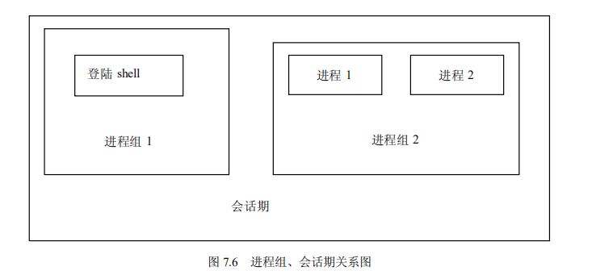

（1）setsid 函数作用

setsid 函数用于创建一个新的会话，并担任该会话组的组长。调用 setsid 有下面的 3 个 

作用。

- 让进程摆脱原会话的控制

- 让进程摆脱原进程组的控制

- 让进程摆脱原控制终端的控制

（2）setsid 函数格式 


##### 改变当前目录为根目录

这一步也是必要的步骤。使用 fork 创建的子进程继承了父进程的当前工作目录。由于在进程运行过程中，当前目录所在的文件系统（比如“/mnt/usb”等）是不能卸载的，这对以后的使用会造成诸多的麻烦（比如系统由于某种原因要进入单用户模式）。因此，通常的做法是 让“/”作为守护进程的当前工作目录，这样就可以避免上述的问题，当然，如有特殊需要，也可以把当前工作目录换成其他的路径，如/tmp。改变工作目录的常见函数是 chdir。 

##### 重设文件权限掩码

文件权限掩码是指屏蔽掉文件权限中的对应位。比如，有一个文件权限掩码是 050，它 就屏蔽了文件组拥有者的可读与可执行权限。由于使用 fork 函数新建的子进程继承了父进程的文件权限掩码，这就给该子进程使用文件带来了诸多的麻烦。因此，把文件权限掩码设置为 0，可以大大增强该守护进程的灵活性。设置文件权限掩码的函数是 umask。在这里，通常的使用方法为 umask(0)。

##### 关闭文件描述符

同文件权限掩码一样，用 fork 函数新建的子进程会从父进程那里继承一些已经打开了的文件。这些被打开的文件可能永远不会被守护进程读或写，但它们一样消耗系统资源，而且 可能导致所在的文件系统无法卸下。在上面的第二步之后，守护进程已经与所属的控制终端失去了联系。因此从终端输入的字符不可能达到守护进程，守护进程中用常规方法（如 printf）输出的字符也不可能在终端上 显示出来。所以，文件描述符为 0、1 和 2 的 3 个文件（常说的输入、输出和报错这 3 个文件） 已经失去了存在的价值，也应被关闭。

```c
for(i=0;i<MAXFILE;i++) 
 	close(i);
```

#### 创建守护进程的流程图

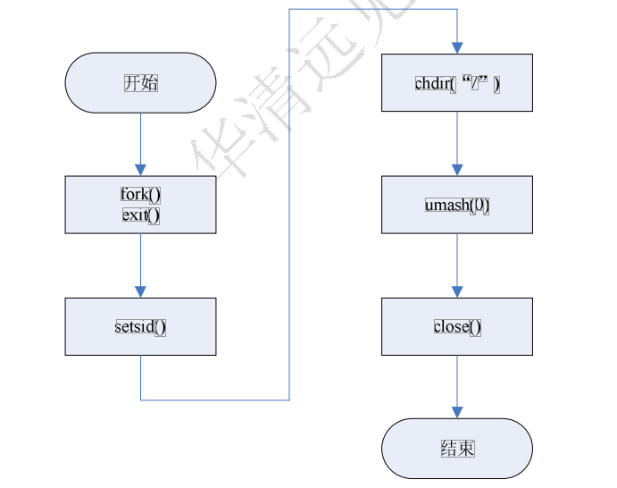